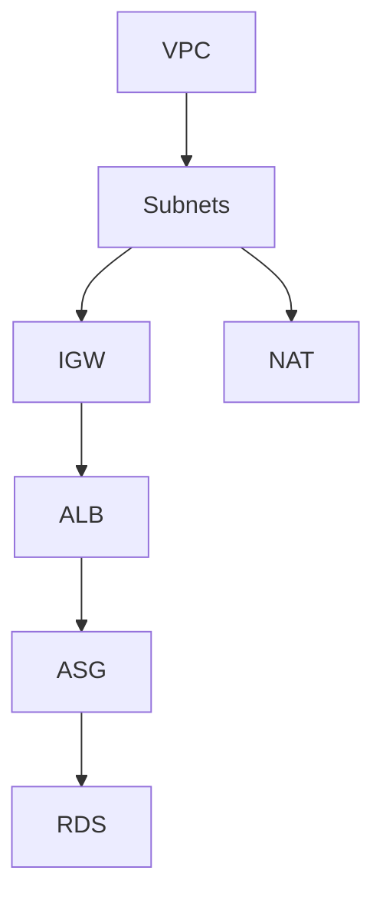

# 🚀 Day 153 – Terraform Best Practices & Code Review

**Date:** 1 August 2026  
**Duration:** ~1.5 Hours  
**Focus:** Elevating Terraform code to Enterprise standards via Provider Pinning, DRY Principles, Graph Visualization, and rigorous Code Reviews.  

---

## 🎯 Objective

Transition from *'writing Terraform that works'* to *'writing Terraform that survives in production'*. Enforce strict module standards, eliminate hardcoded values, and visualize complex dependency trees.

> [!IMPORTANT]
> **The Golden Rule of IaC**  
> If you didn't pin your provider versions, your code is a ticking time bomb. An unpinned module can break silently when HashiCorp pushes a major update.

---

## 🛠️ The Production Refactor (What I Built)

### 1️⃣ Enforcing `versions.tf` (Provider Pinning)
Created a dedicated `versions.tf` file in every module (VPC, RDS, ALB, ASG). Used the **Pessimistic Constraint Operator (`~>`)** to allow minor patches but strictly block major breaking changes.

```hcl
terraform {
  required_version = ">= 1.5.0"

  required_providers {
    aws = {
      source  = "hashicorp/aws"
      version = "~> 5.0"
    }
  }
}
```

### 2️⃣ Visualizing the State Graph
Executed `terraform graph` to map out the exact mathematical order of operations Terraform uses to provision the architecture.



### 3️⃣ Eradicating Anti-Patterns
Refactored the Auto Scaling Group module to completely eliminate hardcoded Amazon Machine Image (AMI) IDs.

**Before (Brittle):**
```hcl
image_id = "ami-0c55b159cbfafe1f0" # Will be deprecated in 6 months
```

**After (Dynamic):**
```hcl
data "aws_ami" "amazon_linux_2" {
  most_recent = true
  owners      = ["amazon"]
  filter {
    name   = "name"
    values = ["amzn2-ami-hvm-*-x86_64-gp2"]
  }
}

resource "aws_launch_template" "this" {
  image_id = data.aws_ami.amazon_linux_2.id
}
```

---

## 📋 The Code Review Checklist

During my self-audit of Project 1, I strictly adhered to the following FAANG-level review standards:

- [x] **No Hardcoded Values:** All static strings converted to variables or data sources.
- [x] **Variable Descriptions:** Every input in `variables.tf` has a clear `description` field.
- [x] **Zero-Trust Security:** RDS Security Group only allows ingress from the Application Security Group.
- [x] **Standard Tagging:** `Environment`, `Project`, and `ManagedBy = "Terraform"` applied to all resources.
- [x] **Modular Cohesion:** Ensured `main.tf`, `outputs.tf`, `variables.tf`, and `versions.tf` are structurally identical across all modules.

---

## 🧠 The Enterprise Engineering Mindset

> [!TIP]
> **Code is read 10x more than it is written.**  
> A missing variable description is just as dangerous as a misconfigured subnet. By enforcing strict documentation directly inside the HCL, I ensure that the next engineer can safely inherit this architecture.

**Milestone Achieved:** August is officially kicked off. Project 1 is not just functional—it is production-ready, peer-reviewed, and structurally pristine. Next stop: Terragrunt.
