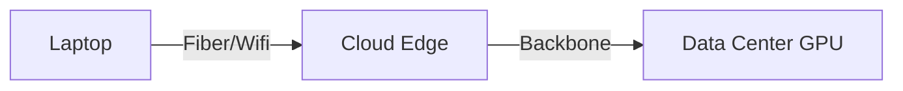
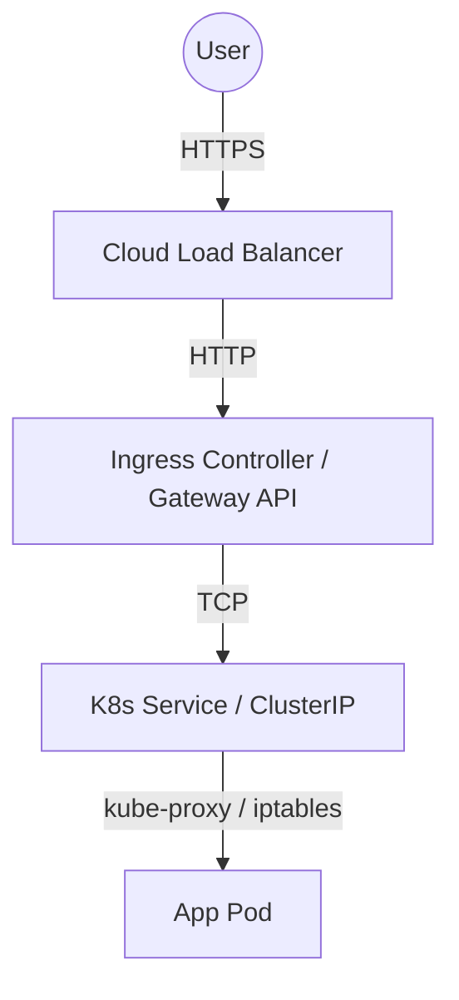

  <h1>🚀 NETWORKING MASTERY IN 6 HOURS</h1>
  <h3><i>The Highest ROI Crash Course for AI, Cloud, Kubernetes, and SRE Professionals</i></h3>

---

Welcome to the ultimate 6-hour networking bootcamp. This is not for CCNA. This is for real-world infrastructure engineers who need to build, scale, and debug massive distributed systems, Kubernetes clusters, and AI training infrastructure.

---

## 🧠 HOUR 0: MENTAL MODELS

### What is Networking?
**1. Simple Explanation:** Networking is the plumbing of the internet. It’s how data moves from point A to point B.
**2. Visualization:**

**3. Real-world Analogy:** The global postal system. You write a letter (data), put it in an envelope with addresses (headers), hand it to the post office (router), and it travels via trucks/planes (cables) to the destination.
**4. Production Example:** A user clicks "Generate" on ChatGPT. The prompt travels through an ISP, enters Cloudflare's edge, routes to Azure's backbone, and lands on an Nvidia H100 GPU cluster.
**5. Interview Question:** *What happens at a packet level when I visit google.com?* (DNS resolution -> TCP Handshake -> TLS Handshake -> HTTP GET).
**6. Troubleshooting Example:** If you can't reach the server, did the letter never leave your house? Did the post office burn down? Or did the recipient move? Use `traceroute`.

---

## ⏱️ HOUR 1 — ABSOLUTE ESSENTIALS

### 🍰 OSI Model vs TCP/IP
**What:** OSI is a theoretical 7-layer model; TCP/IP is the practical 4-layer reality.
**Why:** It gives us a universal language to isolate problems. If the cable is cut (Layer 1), don't debug the API (Layer 7).
**How:** Data is encapsulated (headers added) going down, and decapsulated (headers stripped) going up.
**When:** Use it every time you troubleshoot an outage. Start from L1 (Is it plugged in/DNS resolving?) and move up.
**Interview Version:** *Which layer does a standard Load Balancer operate at?* (Layer 4 for IP/TCP, Layer 7 for HTTP).
**Production Version:** AWS WAF inspects L7 traffic for SQL injection. AWS Security Groups inspect L4 (Ports/IPs).

### 🤝 TCP vs UDP, Ports & Sockets
**What:** TCP guarantees ordered delivery. UDP fires and forgets. Ports are application doors. A Socket is an IP + Port combo.
**Why:** You need TCP for databases (data must be perfect). You need UDP for VoIP/Video (speed beats perfection).
**How:** TCP uses a 3-way handshake (`SYN` -> `SYN-ACK` -> `ACK`). UDP just sends the payload.
**When:** Use TCP for API calls. Use UDP for DNS and statsd metrics.
**Interview Version:** *Why does DNS use UDP?* (A TCP handshake takes 3 packets before sending data; UDP takes 1, making DNS lightning fast).
**Production Version:** A server with 60,000 connections in `TIME_WAIT` is suffering from TCP ephemeral port exhaustion.

### 📖 DNS (Domain Name System)
**What:** The phonebook of the internet. Translates `google.com` to `142.250.190.46`.
**Why:** Humans can't remember IP addresses. IPs change dynamically in the cloud.
**How:** Browser -> Recursive Resolver (ISP/8.8.8.8) -> Root Server -> TLD Server (.com) -> Authoritative Server (Route53).
**When:** Every single API call or web request starts here.
**Interview Version:** *What is the difference between an A record and a CNAME?* (A maps Name->IP. CNAME maps Name->Name).
**Production Version:** Setting a TTL (Time to Live) to 60 seconds before migrating an RDS database endpoint to avoid 24-hour cache poisoning.

### 📍 IP Addressing (IPv4, CIDR, Subnetting)
**What:** IP is the machine's address. CIDR (e.g., `/24`) defines how many IPs are in a network block.
**Why:** To route traffic globally and isolate networks locally.
**How:** `10.0.0.0/16` gives 65,536 IPs. Subnetting breaks this into smaller chunks (e.g., `10.0.1.0/24` = 256 IPs).
**When:** Architecting a new AWS VPC or K8s cluster.
**Interview Version:** *Can you use the 10.x.x.x range on the public internet?* (No, RFC 1918 reserves it for private, non-routable networks).
**Production Version:** EKS pods use real VPC IPs via AWS CNI. If you pick a `/24` for your VPC, your cluster will crash after 250 pods. Always use `/16` for Kubernetes!

### 🔄 NAT, DHCP, & ARP
**What:** 
- **NAT**: Translates private IPs to a public IP. 
- **DHCP**: Automatically hands out IPs to servers. 
- **ARP**: Maps an IP address to a physical MAC address.
**Why:** We ran out of IPv4 addresses (NAT). Manually typing IPs is error-prone (DHCP). Switches only understand MACs (ARP).
**How:** A router rewrites the packet header (NAT), or broadcasts "Who has this IP?" (ARP).
**When:** Whenever a private database needs to download an OS patch from the internet (NAT).
**Interview Version:** *Explain Gratuitous ARP.* (A broadcast used in High Availability setups when a backup LB takes over an IP and forces switches to update their MAC tables instantly).
**Production Version:** Using AWS NAT Gateways to allow private EKS worker nodes to pull container images from DockerHub without being exposed to incoming internet traffic.

---

## ☁️ HOUR 2 — HOW CLOUD NETWORKING REALLY WORKS

*Note: Concepts focus on AWS, with Azure/GCP equivalents noted.*

### 🏢 VPC (Virtual Private Cloud)
**What:** Your logically isolated data center in the cloud. (Azure: VNet. GCP: VPC Network).
**Why:** Security. You don't want your database sitting on the public internet.
**How:** It uses Software-Defined Networking (SDN) to map physical hardware routing to your virtual overlay.
**When:** The first thing you create in any cloud environment.
**Interview Version:** *Can VPCs span multiple regions?* (In AWS/Azure, no. In GCP, yes—GCP VPCs are global).
**Production Version:** A `/16` VPC spanning 3 Availability Zones for High Availability.

### 🗂️ Subnets & Route Tables
**What:** Subnets are slices of a VPC. Route Tables are the directional signs.
**Why:** To isolate public resources (Load Balancers) from private resources (Databases).
**How:** A Public Subnet has a route to an Internet Gateway (IGW). A Private Subnet routes `0.0.0.0/0` to a NAT Gateway.
**When:** Organizing multi-tier architectures.
**Interview Version:** *What makes a subnet "Public"?* (The presence of a route to an IGW in its associated Route Table).
**Production Version:** Never put an RDS database in a public subnet. Always deploy an ALB in the public subnet and proxy traffic to backend EC2s in the private subnet.

### 🛡️ Security Groups & NACLs
**What:** Security Groups (SGs) are firewalls on the instance. Network ACLs are firewalls on the subnet.
**Why:** Defense in depth. SGs protect the server; NACLs protect the entire neighborhood.
**How:** SGs are **Stateful** (if you allow an outbound API call, the inbound response is automatically allowed). NACLs are **Stateless** (you must explicitly write an inbound rule for the ephemeral return ports).
**When:** SGs are used 99% of the time. NACLs are used to explicitly block malicious IPs.
**Interview Version:** *If I open Port 80 on a NACL but block it on the SG, does traffic pass?* (No, SGs evaluate traffic directly at the ENI level).
**Production Version:** Using SG referencing: "Allow Port 3306 on the DB-SG *only* if the traffic comes from the Web-SG."

### 🌉 VPC Peering & Transit Gateway
**What:** Connecting multiple VPCs together.
**Why:** Microservices live in different VPCs, or integrating acquired companies' networks.
**How:** VPC Peering is a 1-to-1 connection. Transit Gateway is a hub-and-spoke router connecting thousands of VPCs.
**When:** Use Peering for < 5 VPCs. Use Transit Gateway for Enterprise-scale meshes.
**Interview Version:** *Is VPC Peering transitive?* (No. If A peers with B, and B peers with C, A cannot talk to C unless A peers directly with C).
**Production Version:** Using AWS Transit Gateway to connect 50 production VPCs and a Direct Connect link to an on-premise data center.

---

## ☸️ HOUR 3 — KUBERNETES NETWORKING

### 📦 Pod Networking & CNI
**What:** Every Pod gets its own unique, routable IP address. CNI (Container Network Interface) plugins make this happen.
**Why:** To avoid port-collision madness. Pods don't have to share `localhost:8080`.
**How:** CNIs like Calico or Cilium create virtual ethernet (`veth`) pairs linking the Pod to the Node's routing table.
**When:** Automatically on pod creation.
**Interview Version:** *Explain the K8s networking model.* (1. All pods can communicate without NAT. 2. All nodes can communicate with all pods without NAT. 3. The IP a pod sees is the IP others see).
**Production Version:** AWS VPC CNI attaches native ENI IPs directly to Pods, making them first-class citizens on the AWS network.

### 🚦 kube-proxy & Services
**What:** Services provide stable IPs (ClusterIP) for dynamic Pods. `kube-proxy` is the daemon that programs the node's firewall to route traffic to the pods.
**Why:** Pods die and IPs change constantly. Services provide a stable endpoint.
**How:** `kube-proxy` writes `iptables` or `IPVS` rules. When traffic hits the `ClusterIP`, the kernel intercepts it and DNATs it to a random backing Pod IP.
**When:** Exposing a deployment internally.
**Interview Version:** *What's the difference between ClusterIP, NodePort, and LoadBalancer?* (ClusterIP is internal-only. NodePort opens a port on every physical worker node. LoadBalancer spawns a cloud ALB/NLB).
**Production Version:** IPVS scales infinitely better than iptables when a cluster exceeds 1,000 services.

### 🚪 Ingress, Gateway API & CoreDNS
**What:** Ingress is L7 routing (path-based). Gateway API is the modern evolution of Ingress. CoreDNS maps service names to IPs.
**Why:** You can't spawn a $20/month AWS LoadBalancer for every microservice. Ingress uses *one* LoadBalancer and routes internally via HTTP paths (`/api`, `/checkout`).
**How:** A user requests `http://my-service`. CoreDNS resolves it to `10.96.x.x`. The Ingress pod (Nginx) proxies the HTTP request.
**When:** Exposing web applications to the public internet.
**Interview Version:** *If a pod tries to curl `database.default.svc.cluster.local`, how does it work?* (CoreDNS intercepts the UDP request and returns the ClusterIP of the database service).
**Production Version:** Using the new Gateway API to delegate route management so the infra team manages the Gateway, and dev teams manage HTTPRoutes.

### 🐝 eBPF, Cilium, & Network Policies
**What:** eBPF allows running sandboxed code in the Linux kernel. Cilium is a CNI built on eBPF. Network Policies are pod firewalls.
**Why:** `iptables` is legacy and slow. eBPF is revolutionary, offering microsecond latency and insane observability.
**How:** eBPF hooks directly into the kernel network stack, bypassing massive amounts of CPU overhead.
**When:** Hardening a cluster (Default Deny Network Policy) or scaling to massive throughput.
**Interview Version:** *Why is eBPF replacing iptables in modern K8s?* (Performance. iptables executes sequentially; eBPF runs compiled, O(1) hash map lookups directly in the kernel).
**Production Version:** Implementing a Network Policy that strictly isolates the `frontend` namespace from the `database` namespace to contain blast radius during a breach.

---

## 🛠️ HOUR 4 — NETWORK TROUBLESHOOTING

### The 10 Essential Commands
**1. `ping`**: Tests ICMP reachability. *Use when:* Checking if a server is entirely dead.
**2. `traceroute` / `mtr`**: Shows every router hop. *Use when:* Finding exactly which ISP/router is dropping packets.
**3. `dig` / `nslookup`**: DNS querying. *Use when:* Checking if a domain resolves to the correct IP. (`dig +short google.com`).
**4. `curl`**: HTTP/API testing. *Use when:* Checking headers, TLS chains, and API responses. (`curl -Iv https://api.com`).
**5. `telnet` / `nc`**: Tests raw TCP/UDP port connectivity. *Use when:* Checking if a firewall is blocking Port 3306.
**6. `ss` / `netstat`**: Shows active socket connections. *Use when:* Checking if your Node.js app actually bound to Port 8080. (`ss -tlpn`).
**7. `tcpdump`**: Raw packet sniffer. *Use when:* You need absolute proof that a packet arrived at the NIC but the app dropped it.
**8. `ip route`**: Shows the routing table. *Use when:* A K8s node can't reach the internet (missing default gateway).

### 🚨 Troubleshooting Flowcharts

**Scenario A: Connection Refused**
1. Does it resolve? (`dig domain.com`). If NO -> Fix DNS.
2. If YES -> Test Port (`nc -zv domain.com 443`).
3. If Refused -> The port is closed. Check if the app is running (`ss -tlpn`). Check Security Groups.

**Scenario B: DNS Issues in Kubernetes**
1. Can the pod reach external IPs? (`curl 8.8.8.8`). If NO -> Node NAT/CNI issue.
2. If YES -> Can it reach CoreDNS? (`ping <coredns-ip>`).
3. Check CoreDNS logs. `kubectl logs -n kube-system -l k8s-app=kube-dns`.

**Scenario C: Timeout Issues**
1. A timeout means traffic is being blackholed. `RST` = Refused. Drop = Timeout.
2. Check NACLs (are ephemeral ports open?).
3. Check Asymmetric Routing (traffic leaves via one router, returns via another).

---

## 🤖 HOUR 5 — AI INFRASTRUCTURE NETWORKING

*AI networking is unlike web networking. Web networking optimizes for concurrency. AI networking optimizes for massive bandwidth, zero packet loss, and nanosecond latency.*

### 🚀 Distributed Training & NCCL
**What:** Training a 1Trillion parameter LLM requires thousands of GPUs splitting the workload. Nvidia Collective Communications Library (NCCL) manages how GPUs talk to each other.
**Why:** A single GPU takes centuries to train GPT-4.
**How:** Uses algorithms like Ring-AllReduce. GPUs pass gradient updates in a massive circle simultaneously.
**When:** Training large scale AI models.
**Production Version:** Using AWS P5 instances clustered together via EFA (Elastic Fabric Adapter).

### ⚡ RDMA, RoCE, & InfiniBand
**What:** 
- **RDMA (Remote Direct Memory Access)**: A GPU writes data directly into the memory of a GPU on another server. Bypasses the CPU and OS kernel entirely.
- **InfiniBand**: A proprietary networking standard by Nvidia built strictly for lossless, ultra-fast RDMA.
- **RoCE (RDMA over Converged Ethernet)**: Running RDMA over standard Ethernet switches.
**Why:** The Linux Kernel TCP stack adds ~50 microseconds of latency. In AI, that is catastrophically slow. RDMA cuts this to ~1 microsecond.
**How:** NICs handle the transport layer in hardware.
**Interview Version:** *Why not use standard TCP/Ethernet for GPU clusters?* (TCP drops packets on congestion and requires CPU interrupts. InfiniBand uses Priority Flow Control to prevent drops, and RDMA bypasses the CPU).

### 🔌 NVLink vs GPUDirect vs East-West Traffic
**What:** 
- **NVLink**: Copper cables physically connecting 8 GPUs *inside* a single server box (insane bandwidth: 900 GB/s).
- **GPUDirect**: Allows the NIC to read/write directly to GPU memory without copying to System RAM first.
- **East-West Traffic**: Server-to-server traffic (AI Training relies 99% on East-West). North-South is User-to-Server.
**Why:** The PCIe bus inside a motherboard is too slow for 8 GPUs talking at once.
**Production Version:** OpenAI's clusters are massive Spine-Leaf InfiniBand networks ensuring non-blocking East-West traffic.

### 🛑 Bottlenecks: Inference vs Training
**Training:** Heavily bottlenecked by East-West network bandwidth. If the network stalls, 10,000 GPUs idle, burning $100k/hour.
**Inference (Serving the Model):** Bottlenecked by memory bandwidth (KV Cache) and North-South latency. Uses WebSocket/Server-Sent Events (SSE) to stream tokens back to the user fast.

---

## 🎤 HOUR 6 — INTERVIEW MASTERY

### 🔥 Top 25 Highest ROI Questions (Distilled from 100)

**1. Q: Describe what happens from a network perspective when you type `kubectl port-forward`.**
*Interviewer Expectation:* You understand that it creates a TCP tunnel from your local machine, through the API server, to the kubelet on the node, which streams into the pod's network namespace.

**2. Q: Why is overlapping CIDR blocks bad when setting up VPC Peering?**
*Interviewer Expectation:* Routing ambiguity. If both VPCs are `10.0.0.0/16`, the router drops packets because it doesn't know if the IP is local or remote. Requires complex NAT solutions.

**3. Q: How does a Layer 7 Load Balancer differ from a Layer 4 Load Balancer for a web app?**
*Interviewer Expectation:* L4 just forwards raw TCP streams (fast, preserves IP). L7 terminates the connection, reads the HTTP headers, allows smart path-routing, but requires injecting `X-Forwarded-For` to preserve the user's IP.

**4. Q: What is the difference between Stateful and Stateless firewalls?**
*Interviewer Expectation:* AWS Security Groups are stateful (auto-allows return traffic). NACLs are stateless (you must manually allow inbound ephemeral ports 1024-65535 for return traffic).

**5. Q: Explain BGP and why it's used.**
*Interviewer Expectation:* Border Gateway Protocol. The routing protocol of the internet. Autonomous Systems (AS) announce the IP blocks they own. It chooses the path with the fewest AS hops.

**6. Q: You can ping a server, but curl times out. Why?**
*Interviewer Expectation:* ICMP (ping) is allowed, but TCP port 80/443 is blocked by a firewall, or the web application process has crashed and nothing is listening on the port.

**7. Q: Why do massive GPU clusters use InfiniBand over Ethernet?**
*Interviewer Expectation:* InfiniBand provides lossless networking at the hardware layer and native RDMA. Ethernet relies on TCP which drops packets on congestion, forcing retransmissions and causing catastrophic synchronization delays during AI training.

**8. Q: How does eBPF improve Kubernetes networking?**
*Interviewer Expectation:* It replaces `iptables`. Iptables processes rules sequentially (O(n)), making it choke on 10k+ services. eBPF runs compiled C code in the kernel using hash maps (O(1)), offering insane performance and observability.

**9. Q: What is a SYN Flood attack?**
*Interviewer Expectation:* An attacker sends thousands of TCP SYN packets but never completes the 3-way handshake with an ACK. The server exhausts its memory holding open half-connections. Mitigated via SYN Cookies.

**10. Q: What is SNI (Server Name Indication)?**
*Interviewer Expectation:* It allows a single IP address to host multiple SSL certificates. The client sends the domain name in the unencrypted `ClientHello` phase of the TLS handshake, so the server knows which cert to return.

*(Note: Understand these 10 deeply, and you can extrapolate answers for the other 90 typical questions).*

---

## 🗂️ FINAL CHEAT SHEET: THE 10-PAGE CONDENSATION

### Core Commands
- `curl -Iv https://domain.com` (Check HTTP headers & TLS details)
- `ss -tulpn` (List all listening ports and processes)
- `dig +short domain.com` (Quick DNS resolve)
- `tcpdump -i eth0 port 443` (Sniff HTTPS traffic)
- `traceroute -T -p 443 8.8.8.8` (TCP traceroute bypassing ICMP blocks)

### Key Ports
- **22**: SSH
- **53**: DNS (UDP/TCP)
- **80/443**: HTTP/HTTPS
- **3306**: MySQL
- **5432**: PostgreSQL
- **6443**: K8s API Server
- **10250**: Kubelet API

### Kubernetes Networking Path
1. **User** -> Hits Route53 (DNS)
2. **DNS** -> Returns AWS ALB IP
3. **ALB (External)** -> Routes to NodePort on Worker Nodes
4. **Node `iptables`/`eBPF`** -> Routes to Ingress Pod (Nginx)
5. **Ingress Pod** -> Reads HTTP `/path`, routes to `ClusterIP`
6. **ClusterIP** -> DNATs to Backend App `Pod IP`
7. **App Pod** -> Queries `CoreDNS` to find Database Pod
8. **App Pod** -> Connects to DB via Calico/Cilium Overlay Network.

### Cloud Networking Survival Guide (AWS)
- **VPC limits**: 5 VPCs per region by default.
- **NAT GW**: Costs money per GB processed. Use VPC Endpoints (PrivateLink) for AWS services (S3/Dynamo) to bypass the public internet and save money.
- **IGW**: Just a logical attachment. It doesn't become a bottleneck.
- **Route Table order**: Most specific route wins (e.g., `10.0.1.0/24` beats `0.0.0.0/0`).

### AI Networking Survival Guide
- **PCIe**: 64 GB/s. Connects CPU to GPU. Too slow for AI.
- **NVLink**: 900 GB/s. Connects GPU to GPU inside a server.
- **InfiniBand/RoCE**: 400 Gbps. Connects Server to Server across a datacenter.
- **RDMA**: Bypass CPU. Direct memory-to-memory transfer over the network.
- **Ring-AllReduce**: The algorithm GPUs use to sync weights simultaneously without a master bottleneck.

### Troubleshooting Cheat Code
If an API is down, follow the OSI model bottom-up:
- **L1/L2**: Is the EC2 running? Check AWS console.
- **L3**: Can I ping the IP? Check Route Tables, NACLs, Subnets.
- **L4**: Can I `telnet` the Port? Check Security Groups, target process (`ss -tlpn`).
- **L7**: Can I `curl` the path? Does DNS resolve? Is the SSL cert expired? Check app logs.

---

  <i>You are now equipped to dominate any cloud, K8s, or AI infrastructure interview.</i> 
  <b>Go build the future. 🚀</b>

