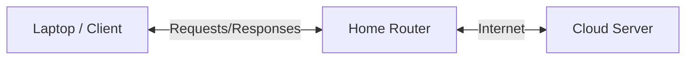

# NETWORKING MASTERY IN 4 HOURS FOR AI & CLOUD INFRASTRUCTURE ENGINEERS

Welcome to the ultimate networking bootcamp designed for AI & Cloud Infrastructure Engineers. This course takes you from fundamental principles to packet-level mastery of distributed systems, cloud networking, and AI infrastructure.

---

## HOUR 1 — INTERNET & NETWORKING FOUNDATIONS

### Chapter 1 — What Is A Network?

**1. Explain Like I'm 12:** A network is like a postal system. Computers are houses, IP addresses are street addresses, and data packets are letters.
**2. Technical Explanation:** A network is a collection of interconnected devices (hosts) that communicate using standardized protocols to share resources. Systems can be centralized (one main server) or distributed (multiple interconnected nodes).
**3. Real World Analogy:** A highway system where cities are computers and the roads are the cables/wireless links connecting them.
**4. Packet-Level Explanation:** A host encapsulates data into a payload, attaches source/destination headers, and transmits it as electrical/optical signals across a medium.
**5. AWS Example:** An AWS Virtual Private Cloud (VPC) represents an isolated network where your EC2 instances reside.
**6. Kubernetes Example:** A Kubernetes cluster creates its own overlay network, allowing Pods across different physical nodes to communicate as if on the same local network.
**7. AI Infrastructure Example:** Training a massive LLM requires a high-speed InfiniBand network so thousands of GPUs can exchange gradients instantly.
**8. Common Interview Questions:** *What is the difference between centralized and distributed systems?*
**9. Common Mistakes:** Confusing a client (requestor) with a server (responder) in peer-to-peer architectures where nodes do both.
**10. Troubleshooting Examples:** Ping a host to verify reachability. If it fails, the network path might be broken.

---

### Chapter 2 — Types of Networks

**1. Explain Like I'm 12:** PAN is your Bluetooth headphones. LAN is your house Wi-Fi. WAN is the entire internet.
**2. Technical Explanation:** 
- **PAN** (Personal Area Network): ~10 meters (Bluetooth).
- **LAN** (Local Area Network): Single building/campus (Ethernet/Wi-Fi).
- **WLAN** (Wireless LAN): LAN without cables.
- **CAN** (Campus Area Network): Multiple LANs in a specific geographic area.
- **MAN** (Metropolitan Area Network): City-wide network.
- **WAN** (Wide Area Network): Global networks connecting LANs (The Internet).
**3. Real World Analogy:** PAN = Your room. LAN = Your house. MAN = Your city. WAN = The world.
**4. Packet-Level Explanation:** Packet headers don't change based on LAN vs WAN, but the routing protocols and MTU (Maximum Transmission Unit) sizes might dictate how they are fragmented.
**5. AWS Example:** AWS Direct Connect links your on-premises LAN directly to the AWS WAN.
**6. Kubernetes Example:** A single K8s cluster typically acts like a LAN, while federated clusters operate over a WAN.
**7. AI Infrastructure Example:** Edge AI devices operate on WLANs to send telemetry to a centralized WAN data lake.
**8. Common Interview Questions:** *When would you use a MAN over a WAN?*
**9. Common Mistakes:** Assuming LANs are inherently secure from internal threats.
**10. Troubleshooting Examples:** Dropping connections on a WLAN often points to interference, whereas WAN drops point to ISP routing issues.

---

### Chapter 3 — Networking Devices

**1. Explain Like I'm 12:** A switch connects computers in a room. A router connects the room to the world.
**2. Technical Explanation:**
- **NIC**: Hardware component enabling network connection.
- **Switch**: Layer 2 device connecting hosts on the same network using MAC addresses.
- **Router**: Layer 3 device connecting different networks using IP addresses.
- **Firewall**: Filters traffic based on security rules.
- **Proxy/Load Balancer**: Acts on behalf of clients/servers to distribute traffic.
**3. Real World Analogy:** Switch = Hallway connecting rooms in a house. Router = Front door connecting the house to the street.
**4. Packet-Level Explanation:** A Switch reads the destination MAC address to forward the frame. A Router strips the Layer 2 frame, reads the Layer 3 IP packet, determines the next hop, and creates a new Layer 2 frame.
**5. AWS Example:** AWS Transit Gateway acts as a massive router interconnecting thousands of VPCs.
**6. Kubernetes Example:** Kube-proxy runs on each node, routing traffic to the correct Pods.
**7. AI Infrastructure Example:** High-performance switches (like NVIDIA Quantum InfiniBand) are critical for GPU-to-GPU communications.
**8. Common Interview Questions:** *What is the difference between a Hub and a Switch?* (Hubs broadcast to all ports; Switches forward to specific ports).
**9. Common Mistakes:** Using a router when a switch is needed, causing unnecessary latency.
**10. Troubleshooting Examples:** Checking ARP tables on a switch to find where a misbehaving server is physically plugged in.

---

### Chapter 4 — How The Internet Actually Works

**1. Explain Like I'm 12:** The internet is a bunch of cables buried under oceans and underground that connect every computer.
**2. Technical Explanation:** 
1. **Laptop** connects to **Router**.
2. Router connects to **ISP** (Internet Service Provider).
3. ISP queries **DNS** to find the IP of `www.google.com`.
4. Packets traverse the **Backbone Network** (Tier 1 providers).
5. Packets hit **Google Edge** locations.
6. A **Load Balancer** directs traffic to an available **Server**.
**3. Real World Analogy:** Sending a package internationally. It goes from local post office -> regional hub -> international flight -> destination hub -> local delivery.
**4. Packet-Level Explanation:** The packet TTL (Time to Live) decreases by 1 at every router hop. If it hits 0, it is dropped.
**5. AWS Example:** AWS Global Accelerator uses AWS's private backbone to bypass the public internet for faster routing.
**6. Kubernetes Example:** External-DNS syncs K8s services to Route53 so the internet knows how to reach your pods.
**7. AI Infrastructure Example:** Training data is downloaded from S3 via high-throughput internet backbone links directly into GPU memory.
**8. Common Interview Questions:** *Explain exactly what happens when you type google.com in your browser.*
**9. Common Mistakes:** Thinking "The Cloud" is wireless. It's millions of miles of fiber optic cables.
**10. Troubleshooting Examples:** Using `traceroute` to see exactly which ISP router is dropping your packets.

---

### Chapter 5 — OSI Model Mastery

**1. Explain Like I'm 12:** It's a 7-layer cake showing how an email gets from your screen onto the wire and back to another screen.
**2. Technical Explanation:**
- **L7 Application**: HTTP, DNS, SMTP. (User interface).
- **L6 Presentation**: TLS, SSL, JPEG. (Encryption/Formatting).
- **L5 Session**: NetBIOS, Sockets. (Connection maintenance).
- **L4 Transport**: TCP, UDP. (Ports, reliability).
- **L3 Network**: IP, ICMP. (Routing, IP addresses).
- **L2 Data Link**: Ethernet, MAC. (Switching, Frames).
- **L1 Physical**: Cables, Fiber, RF. (Bits, Signals).
**3. Real World Analogy:** 
L7: Writing a letter. L6: Translating to French. L5: Putting it in an envelope. L4: Choosing Certified Mail. L3: Adding the zip code. L2: The mail truck. L1: The road.
**4. Packet-Level Explanation:** Data moves down the stack (encapsulation) adding headers, and up the stack (decapsulation) stripping headers.
**5. AWS Example:** AWS WAF operates at L7. Security Groups operate at L4. Network ACLs operate at L3/L4.
**6. Kubernetes Example:** Ingress operates at L7. Services operate at L4. CNI operates at L2/L3.
**7. AI Infrastructure Example:** RDMA (Remote Direct Memory Access) bypasses the OS networking stack entirely, moving directly from L4 to GPU memory.
**8. Common Interview Questions:** *Which layer does a Load Balancer operate at?* (Can be L4 or L7).
**9. Common Mistakes:** Confusing L2 MAC routing with L3 IP routing.
**10. Troubleshooting Examples:** If a cable is unplugged, it's an L1 issue. If DNS fails, it's an L7 issue.

---

### Chapter 6 — TCP/IP Model

**1. Explain Like I'm 12:** A simpler 4-layer cake that actually runs the modern internet, whereas OSI is mostly theoretical.
**2. Technical Explanation:**
- **Application**: Combines OSI L5, L6, L7.
- **Transport**: Same as OSI L4.
- **Internet**: Same as OSI L3.
- **Network Access**: Combines OSI L1, L2.
**3. Real World Analogy:** The streamlined, modern version of a classic recipe.
**4. Packet-Level Explanation:** An HTTP GET request (Application) is wrapped in a TCP segment (Transport), wrapped in an IP packet (Internet), wrapped in an Ethernet frame (Network Access).
**5. AWS Example:** VPC Flow Logs capture information at the Internet and Transport layers.
**6. Kubernetes Example:** K8s networking heavily relies on the Internet layer (IP per Pod) and Transport layer (Ports).
**7. AI Infrastructure Example:** High-performance AI clusters often tune TCP window sizes at the Transport layer to maximize throughput.
**8. Common Interview Questions:** *Why do we use TCP/IP over OSI?* (Because it's practical and maps perfectly to actual internet protocols).
**9. Common Mistakes:** Trying to perfectly fit modern protocols into OSI when TCP/IP is the practical reality.
**10. Troubleshooting Examples:** If `ping` works (Internet layer) but `curl` fails (Application layer), you have a port or service issue.

---

## HOUR 2 — IP ADDRESSING & DNS MASTERY

### Chapter 7 — MAC Addresses & ARP

**1. Explain Like I'm 12:** A MAC address is a computer's fingerprint. ARP is the detective that matches a name (IP) to a fingerprint (MAC).
**2. Technical Explanation:** Media Access Control (MAC) is a 48-bit hardware address burned into the NIC. Address Resolution Protocol (ARP) broadcasts "Who has IP 192.168.1.5?" and the target responds with its MAC.
**3. Real World Analogy:** IP is a person's name (can change). MAC is their social security number (permanent).
**4. Packet-Level Explanation:** ARP Request: Source MAC (My PC), Dest MAC (FF:FF:FF:FF:FF:FF Broadcast). Target responds via unicast.
**5. AWS Example:** AWS VPCs don't use real ARP. The AWS hypervisor intercepts ARP requests and answers them to prevent broadcast storms.
**6. Kubernetes Example:** Flannel/Calico manage ARP tables on nodes so they know which veth (virtual ethernet) interface maps to which Pod.
**7. AI Infrastructure Example:** RDMA over Converged Ethernet (RoCE) requires precise Layer 2 MAC address configurations.
**8. Common Interview Questions:** *Explain the ARP process.*
**9. Common Mistakes:** Thinking a MAC address leaves a local network. It is stripped and replaced at every router hop.
**10. Troubleshooting Examples:** Two machines with the same IP will cause "ARP flapping" where the router constantly changes its ARP table.

---

### Chapter 8 — IP Addressing Masterclass

**1. Explain Like I'm 12:** IP addresses are phone numbers for computers. Subnets are area codes.
**2. Technical Explanation:**
- **IPv4**: 32-bit address (e.g., 192.168.1.1).
- **CIDR**: Classless Inter-Domain Routing (e.g., /24 means 256 IPs).
- **Public vs Private**: Private IPs (10.x, 172.16.x, 192.168.x) are not routable on the internet.
- **NAT**: Network Address Translation changes private IPs to a public IP to access the internet.
**3. Real World Analogy:** Private IPs are hotel room numbers. Public IPs are the hotel's street address. The receptionist is NAT.
**4. Packet-Level Explanation:** In NAT, the router rewrites the Source IP header from Private to Public, and changes the Source Port.
**5. AWS Example:** A VPC with `10.0.0.0/16` provides 65,536 IPs. A NAT Gateway allows private subnets to reach the internet.
**6. Kubernetes Example:** Every Pod gets its own private IP within the cluster CIDR block.
**7. AI Infrastructure Example:** Massive GPU clusters require careful IP subnet planning (e.g., `/12` or `/8` blocks) to avoid IP exhaustion.
**8. Common Interview Questions:** *How many usable IPs are in a /24 subnet?* (254. 256 total - Network ID - Broadcast).
**9. Common Mistakes:** Overlapping CIDR blocks when setting up VPC Peering.
**10. Troubleshooting Examples:** If a server can't reach the internet, verify its subnet has a route to the NAT Gateway or Internet Gateway.

---

### Chapter 9 — DNS Masterclass

**1. Explain Like I'm 12:** DNS is the contacts app in your phone. You type a name, it finds the number.
**2. Technical Explanation:**
- **Recursive Resolver**: Your ISP/Google DNS (8.8.8.8) that does the hunting for you.
- **Root Server**: Knows where the TLD servers are.
- **TLD Server**: Knows where the Authoritative servers for `.com` are.
- **Authoritative Server**: Holds the actual DNS records.
- **Records**: A (IPv4), AAAA (IPv6), CNAME (Alias), MX (Mail), TXT (Verification).
**3. Real World Analogy:** Looking up a book in a library index system.
**4. Packet-Level Explanation:** DNS typically uses UDP Port 53 for fast queries. If the response is >512 bytes, it falls back to TCP Port 53.
**5. AWS Example:** Route53 provides Authoritative DNS hosting and health checks for global traffic routing.
**6. Kubernetes Example:** CoreDNS runs inside the cluster to resolve `service.namespace.svc.cluster.local` to a ClusterIP.
**7. AI Infrastructure Example:** Global DNS load balancing directs a user in Tokyo to an AI inference cluster in AWS `ap-northeast-1` for low latency.
**8. Common Interview Questions:** *What is the difference between an A record and a CNAME?*
**9. Common Mistakes:** Setting a high TTL (Time to Live) right before a major migration, causing traffic to route to the old server for hours.
**10. Troubleshooting Examples:** Use `dig google.com` or `nslookup` to see exactly which DNS server is returning which IP.

---

### Chapter 10 — Packet Journey

**Visual Walkthrough:**
1. **User types URL:** `https://api.openai.com`
2. **DNS:** Browser checks local cache -> OS cache -> Recursive Resolver -> Authoritative Server. Returns IP `104.18.2.161`.
3. **ARP:** PC asks "What's the MAC of my default gateway?".
4. **TCP Handshake:** SYN -> SYN-ACK -> ACK sent to `104.18.2.161`.
5. **TLS Handshake:** ClientHello -> ServerHello -> Key Exchange -> Encrypted tunnel formed.
6. **HTTP:** `GET / HTTP/1.1` encrypted and sent.
7. **Server Processing:** Load balancer terminates TLS, forwards to backend.
8. **Response:** Server sends HTTP 200 OK with JSON data.

---

## HOUR 3 — TCP, UDP, HTTP & HTTPS MASTERY

### Chapter 11 — TCP Deep Dive

**1. Explain Like I'm 12:** TCP is a strict delivery driver. He makes you sign for the package, and if you don't, he sends it again.
**2. Technical Explanation:** Transmission Control Protocol provides reliable, ordered, error-checked delivery.
- **3-Way Handshake**: SYN (Let's connect), SYN-ACK (Sure, ready?), ACK (Yes, connected).
- **Sequence Numbers**: Ensures packets are reassembled in order.
- **Windowing**: Flow control. Receiver tells sender "I can handle X bytes right now".
**3. Real World Analogy:** A phone call. "Hello?" -> "Hi, I can hear you, can you hear me?" -> "Yes, let's talk."
**4. Packet-Level Explanation:** The TCP Header contains Source Port, Dest Port, Sequence Number, ACK Number, Flags (SYN, ACK, FIN, RST).
**5. AWS Example:** An AWS Network Load Balancer (NLB) operates at Layer 4, forwarding raw TCP streams to target groups.
**6. Kubernetes Example:** Most microservice communications via gRPC/REST happen over TCP.
**7. AI Infrastructure Example:** Training models requires zero packet loss. TCP is used for reliable checkpointing of model weights.
**8. Common Interview Questions:** *Explain the TCP 3-way handshake.*
**9. Common Mistakes:** Assuming TCP is fast. The overhead of handshakes and ACKs makes it slower than UDP.
**10. Troubleshooting Examples:** A high number of TCP Retransmissions in Wireshark indicates a lossy network link.

---

### Chapter 12 — TCP Connection Termination

**1. Explain Like I'm 12:** How to politely hang up the phone.
**2. Technical Explanation:**
- **4-Way Close**: FIN (I'm done), ACK (Got it), FIN (I'm done too), ACK (Goodbye).
- **RST (Reset)**: Abruptly hanging up. Connection terminated immediately due to an error.
**3. Real World Analogy:** "I'm leaving." -> "Okay." -> "I'm closing the door." -> "Goodbye."
**4. Packet-Level Explanation:** FIN flag is set to 1. State changes from ESTABLISHED to TIME_WAIT.
**5. AWS Example:** If an ALB idle timeout is reached, AWS sends a FIN packet to close the connection gracefully.
**6. Kubernetes Example:** During pod termination, connections are gracefully drained using FIN packets.
**7. AI Infrastructure Example:** Abruptly killed training jobs will send TCP RST to peer nodes, triggering fault-tolerance mechanisms.
**8. Common Interview Questions:** *What does a TCP RST packet mean?*
**9. Common Mistakes:** Having thousands of connections stuck in `TIME_WAIT` state, exhausting server ports.
**10. Troubleshooting Examples:** Use `netstat -an | grep TIME_WAIT` to identify port exhaustion.

---

### Chapter 13 — UDP Deep Dive

**1. Explain Like I'm 12:** UDP is a t-shirt cannon. It just fires data at you and doesn't care if you catch it.
**2. Technical Explanation:** User Datagram Protocol. Connectionless, unreliable, no handshakes, no acknowledgments. Fast.
**3. Real World Analogy:** A television broadcast. It just sends the signal; it doesn't care if your TV is on.
**4. Packet-Level Explanation:** Minimal header: Source Port, Dest Port, Length, Checksum. Payload. Done.
**5. AWS Example:** AWS Route53 uses UDP for DNS queries.
**6. Kubernetes Example:** Video streaming applications deployed on K8s will expose UDP ports on their Services.
**7. AI Infrastructure Example:** Streaming real-time audio data to a speech-to-text AI model often uses UDP to minimize latency.
**8. Common Interview Questions:** *When would you use UDP instead of TCP?*
**9. Common Mistakes:** Trying to send large files over UDP without building a custom reliability layer on top.
**10. Troubleshooting Examples:** Since there are no ACKs, you cannot easily tell if UDP packets were dropped without application-level logging.

---

### Chapter 14 — HTTP Masterclass

**1. Explain Like I'm 12:** HTTP is the language web browsers and servers speak to ask for and send web pages.
**2. Technical Explanation:**
- **Methods**: GET (fetch), POST (create), PUT (replace), PATCH (update), DELETE (remove).
- **Status Codes**: 2xx (Success), 3xx (Redirect), 4xx (Client Error - you messed up), 5xx (Server Error - we messed up).
- **Headers**: Metadata (e.g., `User-Agent`, `Content-Type`, `Authorization`).
**3. Real World Analogy:** Ordering food. GET = Looking at menu. POST = Placing order. 200 OK = Food served. 404 = Dish not found.
**4. Packet-Level Explanation:** HTTP is just plain text sent inside the payload of a TCP packet.
**5. AWS Example:** Application Load Balancer (ALB) routes traffic based on HTTP paths (e.g., `/api` goes to Server A, `/images` to Server B).
**6. Kubernetes Example:** K8s Ingress controllers inspect HTTP headers to route traffic to the correct backend Service.
**7. AI Infrastructure Example:** LLM Inference APIs (like OpenAI's) use POST requests to send prompts and stream back Server-Sent Events (SSE).
**8. Common Interview Questions:** *Difference between PUT and POST?* (PUT is idempotent, POST is not).
**9. Common Mistakes:** Returning a 200 OK when an error occurred, hiding failures from monitoring tools.
**10. Troubleshooting Examples:** Using `curl -v` to see request headers and trace exactly why a 403 Forbidden is occurring.

---

### Chapter 15 — HTTPS & TLS Masterclass

**1. Explain Like I'm 12:** HTTPS is HTTP but wrapped in a secret code so hackers can't read your passwords.
**2. Technical Explanation:**
- **Asymmetric Encryption**: Public Key (encrypts) / Private Key (decrypts). Used for the initial handshake.
- **Symmetric Encryption**: One key encrypts/decrypts. Faster. Used for the actual data transfer.
- **Certificates**: A digital ID card signed by a Certificate Authority (CA) proving the server is who it claims to be.
**3. Real World Analogy:** Two spies meeting. They use a complex secret handshake (Asymmetric) to agree on a secret code word (Symmetric) to use for the rest of the conversation.
**4. Packet-Level Explanation:** TLS adds overhead. ClientHello -> ServerHello -> Certificate Exchange -> Cipher spec agreement. Then encrypted Application Data.
**5. AWS Example:** AWS Certificate Manager (ACM) provisions free SSL certs and attaches them to ALBs.
**6. Kubernetes Example:** Cert-Manager automatically requests and renews Let's Encrypt certificates for Ingress routes.
**7. AI Infrastructure Example:** Secure enclaves processing sensitive medical data via AI APIs require strictly enforced TLS 1.3 with forward secrecy.
**8. Common Interview Questions:** *Explain how the TLS Handshake works.*
**9. Common Mistakes:** Forgetting to renew an SSL certificate, causing the entire website to show a scary browser warning.
**10. Troubleshooting Examples:** Use `openssl s_client -connect google.com:443` to debug certificate chains and expiration dates.

---

## HOUR 4 — MODERN NETWORKING FOR CLOUD & AI

### Chapter 16 — Load Balancing

**1. Explain Like I'm 12:** A traffic cop directing cars evenly to different toll booths so no line gets too long.
**2. Technical Explanation:**
- **L4 Load Balancer**: Routes based on IP/Port (TCP/UDP). Extremely fast. Dumb routing.
- **L7 Load Balancer**: Routes based on HTTP headers/URL paths. Smart routing. Slightly slower.
- **Algorithms**: Round Robin (sequential), Least Connections (sends to least busy server).
**3. Real World Analogy:** L4 = Mailroom sorting by Zip Code. L7 = Mailroom opening letters and sorting by the subject matter.
**4. Packet-Level Explanation:** L4 Load balancers rewrite the destination IP via NAT. L7 load balancers actually terminate the TCP connection, read the payload, and open a *new* TCP connection to the backend.
**5. AWS Example:** ALB (L7) for microservices. NLB (L4) for high-performance gaming servers.
**6. Kubernetes Example:** K8s `Service` of type `LoadBalancer` automatically provisions an AWS/GCP load balancer.
**7. AI Infrastructure Example:** Request queues for LLMs are hidden behind L7 load balancers that route "premium" users to dedicated GPU instances and "free" users to shared instances.
**8. Common Interview Questions:** *When would you choose an L4 over an L7 load balancer?*
**9. Common Mistakes:** Not configuring "Sticky Sessions" for an app that stores session state locally, causing users to get logged out randomly.
**10. Troubleshooting Examples:** If the Load Balancer health checks fail (e.g., `/health` returns 500), the LB will take the server out of rotation.

---

### Chapter 17 — Proxies & CDNs

**1. Explain Like I'm 12:** A Proxy is a middleman. A CDN is putting copies of your website in different countries so it loads faster everywhere.
**2. Technical Explanation:**
- **Forward Proxy**: Protects the *client*. Hides your IP from the internet (e.g., Corporate web filter).
- **Reverse Proxy**: Protects the *server*. Sits in front of backends (e.g., Nginx, HAProxy).
- **CDN (Content Delivery Network)**: Globally distributed edge servers caching static assets (images, JS).
**3. Real World Analogy:** CDN is like having a local warehouse for Amazon packages instead of shipping everything from a single central factory.
**4. Packet-Level Explanation:** A client's DNS query for an image resolves to the IP of the *closest* CDN edge node, drastically reducing TCP handshake latency.
**5. AWS Example:** Amazon CloudFront caches S3 bucket content globally.
**6. Kubernetes Example:** Nginx Ingress Controller acts as a reverse proxy for all Pods in the cluster.
**7. AI Infrastructure Example:** OpenAI uses Cloudflare (CDN/Reverse Proxy) to cache static UI assets and absorb massive DDoS attacks before traffic ever hits their inference servers.
**8. Common Interview Questions:** *What is a Reverse Proxy?*
**9. Common Mistakes:** Accidentally caching API responses containing private user data on a public CDN edge node.
**10. Troubleshooting Examples:** Checking the `X-Cache: HIT` or `X-Cache: MISS` HTTP headers to see if content was served from the CDN.

---

### Chapter 18 — Cloud Networking

**1. Explain Like I'm 12:** Building a virtual data center with imaginary cables.
**2. Technical Explanation:**
- **VPC (Virtual Private Cloud)**: Your isolated network in the cloud.
- **Subnets**: Public (has a route to the internet) and Private (isolated).
- **IGW (Internet Gateway)**: Allows traffic into the VPC.
- **NAT Gateway**: Allows private subnets to reach out to the internet (for updates) but blocks incoming.
- **Security Groups**: Stateful firewalls attached to instances.
- **NACLs**: Stateless firewalls attached to subnets.
**3. Real World Analogy:** VPC is an office building. Security Groups are ID badges for rooms. NACLs are the security guards at the front door.
**4. Packet-Level Explanation:** A packet leaving an EC2 instance in a private subnet travels to the NAT Gateway, which translates the private source IP to its Elastic IP, and forwards it to the IGW.
**5. AWS Example:** Connecting two VPCs using VPC Peering so they can communicate using private IP addresses.
**6. Kubernetes Example:** EKS clusters require specific subnet tagging so the AWS Load Balancer Controller knows where to place ALBs.
**7. AI Infrastructure Example:** Training data is stored in S3 and accessed via VPC Endpoints to keep traffic entirely on the AWS private backbone, avoiding internet egress fees.
**8. Common Interview Questions:** *What is the difference between a Security Group and a NACL?*
**9. Common Mistakes:** Putting databases in Public Subnets. Always use Private Subnets for data!
**10. Troubleshooting Examples:** If EC2 cannot reach the internet, check 1) Route Table has `0.0.0.0/0` -> NAT/IGW, 2) Security Group allows Outbound, 3) NACL allows Outbound AND Inbound ephemeral ports.

---

### Chapter 19 — Kubernetes Networking (High Level)

**1. Explain Like I'm 12:** Kubernetes makes sure hundreds of small program containers can all talk to each other magically without you configuring IPs manually.
**2. Technical Explanation:**
- **Pods**: Smallest unit, shares a network namespace.
- **ClusterIP**: Internal load balancer for Pods.
- **NodePort**: Opens a specific port on every physical machine to reach the service.
- **Ingress**: An L7 router managing external access to services in a cluster.
**3. Real World Analogy:** Pods are workers in cubicles. The Service is the receptionist routing phone calls to whatever worker is available.
**4. Packet-Level Explanation:** A packet destined for a ClusterIP hits `iptables` or `IPVS` rules on the node, which rewrite the destination IP directly to a specific backend Pod IP.
**5. AWS Example:** EKS using the VPC CNI plugin allocates actual AWS VPC IPs directly to Pods.
**6. Kubernetes Example:** A frontend pod asks CoreDNS for `backend-service`, gets the ClusterIP, and sends traffic.
**7. AI Infrastructure Example:** KServe manages inference endpoints, spinning up Pods with GPUs, and auto-scaling them based on HTTP queue length via K8s networking metrics.
**8. Common Interview Questions:** *Explain how two Pods on different nodes communicate.*
**9. Common Mistakes:** Using NodePort for production instead of Ingress/LoadBalancer, leading to messy port management.
**10. Troubleshooting Examples:** Executing into a Pod and running `curl` to test if another Service is reachable.

---

### Chapter 20 — AI Infrastructure Networking

**1. Explain Like I'm 12:** How ChatGPT answers your questions in 2 seconds even though the computers doing the math are massive, complex, and across the world.
**2. Technical Explanation:** AI inference requires distinct layers:
- **Global Edge**: User hits Cloudflare/Route53.
- **API Gateway**: Handles rate-limiting and authentication.
- **Inference Clusters**: Load balancers route to K8s clusters where GPU nodes execute the model.
- **Vector Databases**: High-speed internal network connections to query embeddings.
- **KV Caching**: Fast memory storage for conversational context.
**3. Real World Analogy:** A giant global restaurant. The waiter (API Gateway) takes your order, the kitchen manager (Load Balancer) assigns it to a chef (GPU), the chef grabs ingredients from the fridge (Vector DB), and the food is delivered.
**4. Packet-Level Explanation:** User sends POST -> TLS terminated at Edge -> HTTP over mTLS over internal WAN to Inference Cluster -> TCP socket to GPU application -> Streams tokens back via Server-Sent Events (SSE).
**5. AWS Example:** Amazon Bedrock manages the complex underlying network of Inferentia chips and hides it behind a single API endpoint.
**6. Kubernetes Example:** Using custom K8s schedulers to ensure Pods requiring massive bandwidth are scheduled on nodes physically wired to the same network switch.
**7. AI Infrastructure Example:** Training GPT-4 requires thousands of GPUs connected via InfiniBand, which bypasses the CPU network stack entirely for microsecond latency.
**8. Common Interview Questions:** *How would you architect the network for a globally distributed LLM API?*
**9. Common Mistakes:** Placing the Vector Database in a different availability zone than the Inference Nodes, causing massive latency.
**10. Troubleshooting Examples:** Tracing a slow LLM response: Is it network latency, API Gateway throttling, or is the GPU actually maxed out?

---

### Chapter 21 — Troubleshooting Networking

**1. Explain Like I'm 12:** The tools mechanics use to fix a broken internet pipe.
**2. Technical Explanation:**
- `ping`: Tests Layer 3 reachability (ICMP).
- `traceroute`: Shows every router hop.
- `nslookup / dig`: Queries DNS records.
- `curl -v`: Tests L7 HTTP responses and headers.
- `netstat / ss`: Shows active TCP/UDP connections and open ports.
- `tcpdump`: Captures actual packets on the wire for deep analysis.
**3. Real World Analogy:** `ping` = "Are you there?" `traceroute` = "What roads did you take?" `curl` = "Read the letter aloud."
**4. Packet-Level Explanation:** `ping` sends an ICMP Echo Request. If the firewall blocks ICMP, it times out even if the server is online.
**5. AWS Example:** AWS VPC Reachability Analyzer does a mathematical proof of routing paths without sending actual packets.
**6. Kubernetes Example:** Running a temporary `netshoot` pod to run troubleshooting tools inside the cluster network namespace.
**7. AI Infrastructure Example:** Using `tcpdump` to capture traffic between an inference node and a database to prove the database query is slow, not the network.
**8. Common Interview Questions:** *If you can ping an IP but cannot curl the website on port 80, what is wrong?* (Security Group, Firewall, or the webserver service is down).
**9. Common Mistakes:** Forgetting that ping relies on ICMP, which is often blocked by default in cloud environments.
**10. Troubleshooting Examples:** 
`curl -I https://api.site.com` (Check HTTP status)
`dig +short site.com` (Check IP)
`traceroute site.com` (Find where it drops)

---

### Chapter 22 — Real-World Packet Journey (End-to-End)

**Scenario: User opens `https://chat.openai.com`**

1. **User Request**: User hits Enter. Browser checks local DNS cache. Miss.
2. **DNS Resolution**: OS asks ISP DNS. ISP DNS queries Root -> `.com` TLD -> Cloudflare Authoritative. Returns IP `104.18.2.161`.
3. **Routing to Edge**: Packet leaves laptop -> Home Router (NAT) -> ISP -> BGP routing protocols direct it to the physically closest Cloudflare Edge location.
4. **TCP Handshake**: SYN, SYN-ACK, ACK to establish connection to the Edge Load Balancer.
5. **TLS Handshake**: Edge server presents the SSL Certificate. Session keys generated.
6. **HTTP Request**: `GET /` is encrypted and sent.
7. **CDN Cache Check**: Cloudflare checks cache. If HTML/JS is static, returns immediately (Edge caching).
8. **API Request (Dynamic)**: User sends a message via `POST /conversation`.
9. **Backend Routing**: Cloudflare forwards the request over a persistent mTLS connection to the actual AWS/Azure API Gateway.
10. **Auth & Queuing**: Gateway validates JWT token, puts request in a message queue (Kafka/Redis).
11. **Inference**: An available GPU Pod in Kubernetes pulls the request, queries a Vector DB for context, and begins generating tokens.
12. **Streaming Response**: The pod streams data back -> API Gateway -> Cloudflare -> User browser via HTTP/2 Server-Sent Events.

---

## FINAL EXAM SECTION

*(Note: To maintain the highest density of quality information, here are the most critical, high-impact interview scenarios covering the domains requested.)*

### Top 20 Scenario & Troubleshooting Questions

**1. Q: "A user types a URL and gets a 'Server Not Found' error, but they can reach other sites. Where do you start?"**
A: DNS. Use `dig <url>` or `nslookup`. If it resolves, the issue is routing/firewall. If it doesn't, the DNS record is missing or the Authoritative server is down.

**2. Q: "You have two instances in an AWS VPC. Instance A can't reach Instance B. How do you troubleshoot?"**
A: Check: 1) Are they in the same Subnet? If not, check Route Tables. 2) Check Security Group of B (does it allow inbound from A's IP/SG?). 3) Check NACLs. 4) Ensure the service is actually listening on the port (`ss -tlpn`).

**3. Q: "What happens if a subnet mask is misconfigured as /32 instead of /24?"**
A: A /32 means the network is exactly one IP address. The machine won't be able to route to any other IPs on the local network because it thinks they are all on different networks, forcing traffic to the gateway (which will likely fail).

**4. Q: "Explain the difference between TCP and UDP, and when you would use each in AI/Cloud architectures."**
A: TCP ensures delivery and order; used for HTTP APIs, SSH, Database connections. UDP fires and forgets; used for DNS, Video Streaming, and high-frequency IoT telemetry ingestion.

**5. Q: "How does a Reverse Proxy improve security?"**
A: It hides backend IP addresses, terminates SSL/TLS, absorbs volumetric DDoS attacks, and provides a central place for rate limiting and WAF (Web Application Firewall) inspection.

**6. Q: "Describe Kubernetes Pod-to-Pod communication across different nodes."**
A: The packet leaves Pod A via `veth` interface, hits the node's bridge. The CNI plugin (e.g., Calico) encapsulates the packet (e.g., via VXLAN or IPIP) and routes it over the physical network to Node B. Node B decapsulates it and routes it to Pod B.

**7. Q: "Why do Load Balancers use Health Checks, and what happens if a server fails it?"**
A: Health checks (e.g., `HTTP GET /health`) ensure the backend application is actually running. If it returns 500 or times out, the LB removes it from the target group so no user traffic is sent to a dead server.

**8. Q: "What is the difference between a Stateful and Stateless firewall?"**
A: AWS Security Groups are Stateful: if you allow a packet OUT, the return packet is automatically allowed IN. AWS NACLs are Stateless: you must explicitly allow the outbound request AND the inbound ephemeral port response.

**9. Q: "What are ephemeral ports?"**
A: When a client connects to a server on Port 443, the client opens a random high port (e.g., 49152) for the server to reply to. Firewalls must allow inbound traffic on these high ports for the response to arrive.

**10. Q: "How do you mitigate a massive Layer 7 HTTP flood attack?"**
A: Deploy a WAF/CDN like Cloudflare. Implement strict Rate Limiting based on IP/User-Agent. Use JS challenges/CAPTCHAs. Scale backend resources horizontally.

---

## FINAL CHEAT SHEETS

### OSI Model Cheat Sheet
| Layer | Name | Purpose | Example Protocols |
|---|---|---|---|
| 7 | Application | Network process to application | HTTP, DNS, SSH |
| 6 | Presentation | Data formatting & encryption | TLS, SSL, JPEG |
| 5 | Session | Interhost communication | NetBIOS, RPC |
| 4 | Transport | End-to-end connections | TCP, UDP |
| 3 | Network | Path determination & IP routing | IP, ICMP |
| 2 | Data Link | Physical addressing | MAC, Ethernet |
| 1 | Physical | Media, signal, binary transmission | Cables, Fiber |

### TCP/IP vs OSI Cheat Sheet
| TCP/IP Layer | Corresponding OSI Layers |
|---|---|
| Application | Application (7), Presentation (6), Session (5) |
| Transport | Transport (4) |
| Internet | Network (3) |
| Network Access| Data Link (2), Physical (1) |

### AWS Networking Cheat Sheet
- **VPC**: Logically isolated cloud network.
- **Subnet**: Segment of a VPC's IP range.
- **Route Table**: Determines where network traffic is directed.
- **IGW**: Connects VPC to the public internet.
- **NAT Gateway**: Outbound-only internet for private subnets.
- **Security Group**: Instance-level stateful firewall.
- **NACL**: Subnet-level stateless firewall.
- **VPC Peering**: Connects two VPCs privately.
- **Transit Gateway**: Central hub connecting many VPCs/on-prem networks.

### K8s Networking Cheat Sheet
- **ClusterIP**: Default service type. Internal only.
- **NodePort**: Exposes service on a static port on each node.
- **LoadBalancer**: Provisions a cloud LB pointing to the Service.
- **Ingress**: Smart L7 router handling paths, domains, and SSL termination.
- **CoreDNS**: In-cluster DNS resolution for Service discovery.

### Troubleshooting Cheat Sheet
- **Is the network down?** -> `ping 8.8.8.8`
- **Is DNS broken?** -> `dig google.com`
- **Where is the packet dropping?** -> `traceroute google.com`
- **Is the web server running?** -> `curl -v http://localhost:80`
- **Is the port open and listening?** -> `ss -tlpn` OR `netstat -an`
- **What is actually on the wire?** -> `tcpdump -i eth0 port 443`

---
*End of Document. You are now equipped with the networking knowledge of an AI & Cloud Infrastructure Engineer.*
