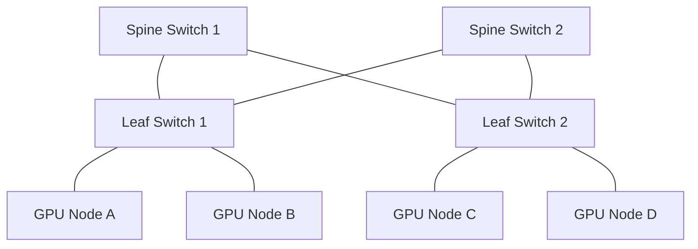

  <h1>🚀 THE DEFINITIVE NETWORKING MASTERY COURSE</h1>
  <h3><i>The Ultimate 4-Hour Bootcamp for AI & Cloud Infrastructure Engineers</i></h3>

---

Welcome to the ultimate networking bootcamp. This course takes you from fundamental principles to packet-level mastery of distributed systems, cloud networking, and AI infrastructure. Grab your coffee. We are going incredibly deep. 🤿

---

## ⏱️ HOUR 1 — INTERNET & NETWORKING FOUNDATIONS

### 🌐 Chapter 1 — What Is A Network?

> [!NOTE]
> **Explain Like I'm 12**
> A network is like a postal system. Computers are houses, IP addresses are street addresses, and data packets are letters.

> [!IMPORTANT]
> **Technical Explanation**
> A network is a collection of interconnected devices (hosts) that communicate using standardized protocols to share resources. Systems can be centralized (client-server) or distributed (peer-to-peer/mesh). Modern cloud computing relies on heavily distributed mesh networks (like spine-leaf topology in data centers) to minimize latency and eliminate single points of failure.

> [!TIP]
> **Real World Analogy**
> A highway system where cities are computers, the roads are the fiber-optic cables connecting them, and the traffic cops are the routers directing the cars (packets).

**🧠 Deep Dives & Cloud Context**
- **📦 Packet-Level:** A host encapsulates application data into a payload, attaches transport headers (ports), network headers (IPs), and data-link headers (MACs). It is then serialized into electrical impulses or light pulses (fiber).
- **☁️ AWS Example:** An AWS Virtual Private Cloud (VPC) represents an isolated network namespace within AWS's massive physical data centers, leveraging Software-Defined Networking (SDN) to isolate your EC2 instances from other tenants.
- **☸️ Kubernetes Example:** A Kubernetes cluster creates its own overlay network (often via VXLAN or eBPF). This allows Pods across different physical nodes to communicate via their own private IP addresses, completely unaware of the underlying physical network.
- **🤖 AI Infrastructure Example:** Training a massive LLM (like GPT-4) requires a high-speed InfiniBand network so thousands of GPUs can exchange gradients instantly using Ring-AllReduce algorithms, bypassing the CPU entirely.

**🎯 Interview & Troubleshooting Mastery**
- **🎤 Q1: What is the difference between a centralized, decentralized, and distributed system?**
  *Answer:* Centralized relies on a single hub (single point of failure). Decentralized has multiple hubs acting as regional masters. Distributed gives every node equal weight and responsibility (e.g., a Cassandra database cluster).
- **🎤 Q2: In a distributed microservice architecture, how do you handle network partitions?**
  *Answer:* Following the CAP theorem, if a partition occurs, the system must choose between Consistency (returning an error if data can't be synced) or Availability (returning stale data). Techniques include circuit breakers, retries with exponential backoff, and asynchronous event queues.
- **🎤 Q3: What is a "Spine-Leaf" network topology and why do modern data centers use it?**
  *Answer:* It replaces the traditional 3-tier architecture. Every leaf switch connects to every spine switch, ensuring that any two servers in the data center are always exactly two hops away, ensuring predictable, low latency (critical for cloud/AI).
- **⚠️ Common Mistake:** Confusing network latency (time to send a packet) with bandwidth (volume of packets sent per second). You cannot fix a latency issue by buying more bandwidth.
- **🛠️ Troubleshooting:** Run `ping <host>` to verify ICMP reachability. If `ping` fails but the app works, a firewall is dropping ICMP packets while allowing TCP.

---

### 🗺️ Chapter 2 — Types of Networks

> [!NOTE]
> **Explain Like I'm 12**
> PAN is your Bluetooth headphones. LAN is your house Wi-Fi. WAN is the entire internet.

> [!IMPORTANT]
> **Technical Explanation**
> - **PAN**: ~10 meters (Bluetooth, NFC).
> - **LAN**: Single building/campus (Ethernet/Wi-Fi). Uses ARP, MAC addressing.
> - **WLAN**: LAN without cables. Uses 802.11 standards.
> - **CAN/MAN**: Campus/Metropolitan Area Networks.
> - **WAN**: Global networks connecting LANs using complex routing protocols like BGP (Border Gateway Protocol) and OSPF.

> [!TIP]
> **Real World Analogy**
> PAN = Your room. LAN = Your house. MAN = Your city. WAN = The world.

**🧠 Deep Dives & Cloud Context**
- **📦 Packet-Level:** When a packet leaves a LAN and enters a WAN, its Source and Destination MAC addresses are continually rewritten at every router hop, while the Source and Destination IP addresses remain unchanged (unless NAT is used).
- **☁️ AWS Example:** **AWS Direct Connect** links your on-premises LAN directly to the AWS WAN via a dedicated physical fiber optic line, bypassing the public internet for lower latency and strict security.
- **☸️ Kubernetes Example:** Multi-cluster networking tools like Cilium ClusterMesh allow K8s clusters in different AWS regions (WAN) to route traffic to each other seamlessly as if they were on the same local network.
- **🤖 AI Infrastructure Example:** Edge AI devices operate on 5G/WLANs to run fast, local inference, but batch telemetry data over the WAN to a centralized data lake for asynchronous model retraining.

**🎯 Interview & Troubleshooting Mastery**
- **🎤 Q1: When would you use a Dedicated WAN Link (like AWS Direct Connect) instead of a Site-to-Site VPN over the public internet?**
  *Answer:* VPNs are cheap but subject to internet weather (unpredictable latency and bandwidth drops). Dedicated links offer guaranteed bandwidth, lower latency, and higher security, required for synchronous database replication or high-frequency trading.
- **🎤 Q2: Explain the Maximum Transmission Unit (MTU) and why it matters in a WAN.**
  *Answer:* MTU is the largest packet size a network can transmit (usually 1500 bytes for standard Ethernet). If a packet is larger than the lowest MTU on the WAN path, it must be fragmented. Fragmentation causes high CPU overhead and packet loss. Jumbo Frames (9000 bytes) are used in LANs to increase throughput.
- **🎤 Q3: What is BGP and why is it called the "glue" of the internet?**
  *Answer:* Border Gateway Protocol is the routing protocol of the internet. It allows different Autonomous Systems (like Comcast, AWS, and Google) to announce which IP blocks they own and find the most efficient path between each other.
- **⚠️ Common Mistake:** Enabling Jumbo Frames (MTU 9000) on your server but leaving the switch at MTU 1500, causing silent packet drops for large payloads.
- **🛠️ Troubleshooting:** Dropping connections on a WLAN often points to radio interference. Use `ping -s 1500 <target>` to test if MTU fragmentation is causing issues over a WAN link.

---

### 🧱 Chapter 3 — Networking Devices

> [!NOTE]
> **Explain Like I'm 12**
> A switch connects computers in a room. A router connects the room to the world.

> [!IMPORTANT]
> **Technical Explanation**
> - **Switch (Layer 2)**: Forwards traffic based on MAC addresses. Builds a MAC Address Table by learning which MAC address is attached to which physical port.
> - **Router (Layer 3)**: Forwards traffic based on IP addresses. Uses Routing Tables to determine the "next hop" for a packet destined for a foreign network.
> - **Firewall (Layer 3/4/7)**: Stateful packet inspection that blocks/allows traffic based on IP, Port, or Application Payload.
> - **Load Balancer (Layer 4/7)**: Distributes traffic across multiple servers to ensure high availability.

> [!TIP]
> **Real World Analogy**
> Switch = The hallway connecting rooms in an office building. Router = The lobby door connecting the office to the street network.

**🧠 Deep Dives & Cloud Context**
- **📦 Packet-Level:** When a router receives a packet, it decrements the IP header's TTL (Time To Live), recalculates the header checksum, strips the old Layer 2 frame, looks up the next hop in its routing table, and encapsulates the packet in a new Layer 2 frame.
- **☁️ AWS Example:** **AWS Transit Gateway** acts as a massive cloud router interconnecting thousands of VPCs and on-premises networks, simplifying the chaotic "peering mesh" architecture.
- **☸️ Kubernetes Example:** The `kube-proxy` component on each K8s node acts like a distributed software load balancer, using IPVS or iptables rules to route service traffic to the correct Pod backend.
- **🤖 AI Infrastructure Example:** Training clusters use high-radix InfiniBand switches which offer sub-microsecond latency and lossless networking (via Priority Flow Control), which standard Ethernet switches cannot guarantee.

**🎯 Interview & Troubleshooting Mastery**
- **🎤 Q1: What happens if a Layer 2 Switch receives a frame destined for a MAC address it doesn't have in its table?**
  *Answer:* It performs "unknown unicast flooding," sending the frame out of every port except the one it was received on. When the target replies, the switch records its MAC address.
- **🎤 Q2: How does a Stateful Firewall differ from a Stateless Firewall (like an AWS NACL)?**
  *Answer:* A stateful firewall tracks connection states (e.g., it remembers you initiated an outbound request to an API, and automatically allows the inbound response). A stateless firewall evaluates every single packet individually; you must explicitly write a rule to allow the return traffic on ephemeral ports.
- **🎤 Q3: What is ARP Spoofing?**
  *Answer:* A malicious actor on a local network broadcasts forged ARP replies, claiming that their MAC address corresponds to the default gateway's IP address. This causes switches to send all internet-bound traffic to the attacker (Man-in-the-Middle attack).
- **⚠️ Common Mistake:** Using software routers (running on a Linux CPU) for high-throughput traffic instead of hardware routers with dedicated ASICs, causing massive CPU bottlenecks.
- **🛠️ Troubleshooting:** If an IP is unreachable, check the routing table (`netstat -rn` or `ip route`). If there is no explicit route and no default gateway (`0.0.0.0/0`), the router will drop the packet.

---

### 🌍 Chapter 4 — How The Internet Actually Works

> [!NOTE]
> **Explain Like I'm 12**
> The internet isn't a cloud. It's millions of miles of massive fiber optic cables buried under oceans and underground that physically connect every data center in the world.

> [!IMPORTANT]
> **Technical Explanation (The Journey)**
> 1. **Laptop** connects to **Router**.
> 2. Router connects to **ISP** (Internet Service Provider) via a modem.
> 3. ISP queries **DNS** to find the target IP.
> 4. Packets traverse the **Backbone Network** (Tier 1 providers like AT&T, Level3) using BGP routing.
> 5. Packets hit **Google Edge** locations (Points of Presence).
> 6. A **Load Balancer** terminates the connection and directs traffic to an available **Server**.

> [!TIP]
> **Real World Analogy**
> Sending a package internationally. It goes from local post office (ISP) ➡️ regional hub ➡️ international flight (Tier 1 Backbone) ➡️ destination hub (Edge) ➡️ local delivery (Load Balancer).

**🧠 Deep Dives & Cloud Context**
- **📦 Packet-Level:** The packet TTL (Time to Live) prevents infinite routing loops. Every router decrements it by 1. If a routing loop exists, the TTL will hit 0, and the router will drop the packet and send an ICMP "Time Exceeded" message back to the source.
- **☁️ AWS Example:** **AWS Global Accelerator** uses AWS's private global backbone. Instead of your packets bouncing across 15 unpredictable public internet routers, they enter the AWS network at the closest Edge Location and travel on AWS's optimized fiber to the target region.
- **☸️ Kubernetes Example:** To expose a service to the public internet, you use an `Ingress` controller which automatically configures an external cloud Load Balancer to accept traffic and route it into the cluster.
- **🤖 AI Infrastructure Example:** Training datasets are massive (petabytes). Companies physically ship AWS Snowmobile trucks rather than downloading over the internet, because even a 10Gbps fiber link would take months to transfer 100 Petabytes.

**🎯 Interview & Troubleshooting Mastery**
- **🎤 Q1: Explain exactly what happens when you type `google.com` in your browser. (Deep Technical)**
  *Answer:* Browser checks local DNS cache -> OS cache -> ISP Recursive Resolver. DNS resolves `google.com` to an IP. OS checks routing table, sends ARP request for default gateway MAC. TCP 3-way handshake is established. TLS handshake secures the tunnel. HTTP GET request is encrypted and sent. Server processes, queries DB, returns HTTP 200 OK with HTML. Browser parses DOM, requests CSS/JS, and renders.
- **🎤 Q2: What is an Autonomous System (AS) and why is it important for the internet?**
  *Answer:* An AS is a large network or group of networks with a unified routing policy (e.g., an ISP or a large tech company like AWS). They use ASNs (Autonomous System Numbers) to peer with each other using BGP, forming the literal fabric of the internet.
- **🎤 Q3: How do undersea fiber optic cables handle signal degradation over thousands of miles?**
  *Answer:* They use optical amplifiers (repeaters) every 50-100 kilometers that boost the light signals without converting them back to electricity.
- **⚠️ Common Mistake:** Assuming "The Cloud" means your data isn't physical. Your code is running on a very real, very loud server in a warehouse in Virginia.
- **🛠️ Troubleshooting:** Run `traceroute google.com` (Mac/Linux) or `tracert google.com` (Windows). Each line represents a router hop. If it times out at hop 5, you know exactly which ISP backbone provider is having an outage.

---

### 🍰 Chapter 5 — OSI Model Mastery

> [!NOTE]
> **Explain Like I'm 12**
> It's a 7-layer cake showing how an email gets from your screen, translated into electricity on a wire, and back to another screen.

> [!IMPORTANT]
> **Technical Explanation**
> - **L7 Application**: Where the user interacts. HTTP, DNS, SMTP, gRPC.
> - **L6 Presentation**: Data formatting, encryption, compression. TLS, SSL, JPEG, JSON.
> - **L5 Session**: Connection maintenance, keeping streams distinct. NetBIOS, RPC.
> - **L4 Transport**: End-to-end reliability and ports. TCP, UDP.
> - **L3 Network**: Logical addressing and routing. IP, ICMP, IPSec.
> - **L2 Data Link**: Physical addressing and switching. Ethernet, MAC addresses, VLANs.
> - **L1 Physical**: Cables, Fiber, RF, bits, electrical signals.

> [!TIP]
> **Real World Analogy**
> L7: Writing a letter. L6: Translating to French. L5: Putting it in an envelope. L4: Choosing Certified Mail. L3: Adding the zip code. L2: The mail truck. L1: The road.

**🧠 Deep Dives & Cloud Context**
- **📦 Packet-Level:** Data moves down the stack (Encapsulation) wrapping the payload in layers like a Matryoshka doll. On the receiving end, it moves up the stack (Decapsulation), stripping headers layer by layer until the pure application data reaches the software.
- **☁️ AWS Example:** AWS WAF (Web Application Firewall) operates at L7, blocking SQL injection attacks. Security Groups operate at L4, blocking IP/Port combos. VPC Peering operates at L3.
- **☸️ Kubernetes Example:** `Ingress` operates at L7 (can route `/api` to one pod and `/images` to another). K8s `Services` operate at L4 (routing traffic to Port 80 regardless of HTTP path).
- **🤖 AI Infrastructure Example:** RDMA (Remote Direct Memory Access) bypasses the OS kernel networking stack completely, reading data directly from the NIC into GPU memory. This effectively bypasses OSI layers 4-7 for maximum throughput.

**🎯 Interview & Troubleshooting Mastery**
- **🎤 Q1: If a Load Balancer is operating at Layer 4 vs Layer 7, what is the architectural difference?**
  *Answer:* A Layer 4 LB simply forwards TCP/UDP packets based on IP/Port without looking inside. It's extremely fast. A Layer 7 LB terminates the TCP/TLS connection, inspects the HTTP headers (can read cookies, URL paths), and makes smart routing decisions. It requires more CPU.
- **🎤 Q2: At which layer does IPSec operate, and how does it secure a VPN?**
  *Answer:* IPSec operates at Layer 3 (Network Layer). It encrypts the entire IP packet payload, meaning the Transport layer (TCP/UDP) and above are hidden from anyone intercepting the traffic.
- **🎤 Q3: What is a VLAN and which OSI layer does it exist on?**
  *Answer:* Virtual LAN operates at Layer 2. It allows network administrators to logically segment a single physical switch into multiple isolated broadcast domains by adding an 802.1Q tag to the Ethernet frame.
- **⚠️ Common Mistake:** Troubleshooting a complex API error (L7) when the ethernet cable is literally unplugged (L1). Always troubleshoot from the bottom up!
- **🛠️ Troubleshooting:** L1/L2: Check link lights on switch. L3: `ping`. L4: `telnet` or `nc` to check port. L7: `curl -v` to check HTTP response.

---

### 🏗️ Chapter 6 — TCP/IP Model

> [!NOTE]
> **Explain Like I'm 12**
> The OSI model is a theory taught in textbooks. The TCP/IP model is the actual 4-layer blueprint that the modern internet is built on.

> [!IMPORTANT]
> **Technical Explanation**
> - **Application (OSI 5,6,7)**: HTTP, FTP, DNS.
> - **Transport (OSI 4)**: TCP, UDP.
> - **Internet (OSI 3)**: IP, ICMP.
> - **Network Access (OSI 1,2)**: Ethernet, Wi-Fi.

**🧠 Deep Dives & Cloud Context**
- **📦 Packet-Level:** An HTTP GET request (Application) is wrapped in a TCP segment (Transport), wrapped in an IP packet (Internet), wrapped in an Ethernet frame (Network Access).
- **☁️ AWS Example:** **VPC Flow Logs** capture information strictly at the Internet and Transport layers (Source IP, Dest IP, Protocol, Port, Bytes). It cannot capture Application layer data (like HTTP paths).
- **☸️ Kubernetes Example:** The Container Network Interface (CNI) heavily manipulates the Internet layer, assigning unique IP addresses to every single container.

**🎯 Interview & Troubleshooting Mastery**
- **🎤 Q1: Why did TCP/IP win over OSI?**
  *Answer:* TCP/IP was practical and built by the DoD/ARPANET for immediate use. The protocols came first, then the model. OSI was theoretical; the model came first, and protocols were forced to fit it, making it clunky.
- **🎤 Q2: Where does ICMP (Ping) live in the TCP/IP model?**
  *Answer:* It lives at the Internet layer. It does not use TCP or UDP ports, which is why you cannot block a "ping port" in a firewall—you must block the ICMP protocol itself.
- **⚠️ Common Mistake:** Assuming IP guarantees delivery. IP (Internet Layer) is "best effort." Only TCP (Transport Layer) guarantees delivery.

---

## ⏱️ HOUR 2 — IP ADDRESSING & DNS MASTERY

### 🕵️‍♂️ Chapter 7 — MAC Addresses & ARP

> [!NOTE]
> **Explain Like I'm 12**
> A MAC address is a computer's permanent physical fingerprint. ARP is the detective that matches a temporary name (IP) to a fingerprint (MAC).

> [!IMPORTANT]
> **Technical Explanation**
> Media Access Control (MAC) is a 48-bit hardware address burned into the NIC (e.g., `00:1A:2B:3C:4D:5E`). Address Resolution Protocol (ARP) is used to map a Layer 3 IP address to a Layer 2 MAC address. The machine broadcasts *"Who has IP 192.168.1.5?"* and the target responds with its MAC.

**🧠 Deep Dives & Cloud Context**
- **📦 Packet-Level:** ARP Request: Source MAC (My PC), Dest MAC (`FF:FF:FF:FF:FF:FF` Broadcast). Target responds via unicast directly to the Source MAC.
- **☁️ AWS Example:** AWS VPCs don't use real ARP. Broadcast traffic is banned in VPCs. Instead, the AWS Nitro Hypervisor intercepts all ARP requests and answers them directly via a localized mapping service to prevent broadcast storms.
- **☸️ Kubernetes Example:** CNI plugins like Flannel manage ARP tables on nodes so the OS kernel knows which virtual `veth` interface maps to which Pod IP.

**🎯 Interview & Troubleshooting Mastery**
- **🎤 Q1: Can two computers on the internet have the same MAC address?**
  *Answer:* Technically yes. Because MAC addresses are only used on local Layer 2 segments and are stripped off at the router, a duplicate MAC address won't cause issues unless both devices are plugged into the exact same local switch.
- **🎤 Q2: What is Gratuitous ARP?**
  *Answer:* An ARP response that was not prompted by an ARP request. It's often used in High Availability (HA) setups. When a primary load balancer dies, the backup load balancer takes over its IP and broadcasts a Gratuitous ARP to force all switches to update their MAC tables instantly.
- **⚠️ Common Mistake:** Looking for MAC addresses in a packet capture (pcap) taken from a remote cloud server. You will only see the MAC of the cloud router, not the original user's laptop.
- **🛠️ Troubleshooting:** Run `arp -a` on your terminal to view your local ARP cache.

---

### 📍 Chapter 8 — IP Addressing Masterclass

> [!NOTE]
> **Explain Like I'm 12**
> IP addresses are phone numbers for computers. Subnets are area codes.

> [!IMPORTANT]
> **Technical Explanation**
> - **IPv4**: 32-bit address space. Depleted.
> - **IPv6**: 128-bit address space. Practically infinite.
> - **CIDR (Classless Inter-Domain Routing)**: Indicates subnet size. e.g., `/24` means the first 24 bits are the network ID, leaving 8 bits for hosts (2^8 = 256 IPs).
> - **Public vs Private**: Private IPs (RFC 1918: `10.x.x.x`, `172.16.x.x`, `192.168.x.x`) are dropped by internet routers.
> - **NAT (Network Address Translation)**: A router translates many private IPs into a single public IP to reach the internet.

**🧠 Deep Dives & Cloud Context**
- **📦 Packet-Level:** In NAT (specifically PAT - Port Address Translation), the router rewrites the Source IP header from Private to Public, and dynamically assigns a new Source Port to keep track of the session.
- **☁️ AWS Example:** A VPC with `10.0.0.0/16` provides 65,536 IPs. AWS reserves the first 4 and the last 1 IP of every subnet for internal DNS and routing. A **NAT Gateway** allows instances in private subnets to reach the internet for patches without being reachable from the internet.
- **☸️ Kubernetes Example:** Every Pod gets its own private IP within the cluster CIDR block. When a Pod talks to the external internet, the node's `iptables` performs SNAT (Source NAT) to use the node's IP.

**🎯 Interview & Troubleshooting Mastery**
- **🎤 Q1: Given the CIDR `10.0.0.0/28`, how many usable IPs are there, and what is the broadcast address?**
  *Answer:* A `/28` leaves 4 bits for hosts (32 - 28 = 4). 2^4 = 16 IPs. Minus network ID (10.0.0.0) and broadcast ID (10.0.0.15), leaving 14 usable IPs.
- **🎤 Q2: Why is overlapping CIDR blocks a disaster in cloud migrations?**
  *Answer:* If your on-premise network is `10.0.0.0/16` and your AWS VPC is also `10.0.0.0/16`, routing is impossible. A router cannot know if traffic destined for `10.0.5.5` should stay local or go across the VPN. You must use NAT, which adds massive complexity.
- **🎤 Q3: Explain the difference between SNAT and DNAT.**
  *Answer:* Source NAT modifies the source IP (used when internal clients reach the internet). Destination NAT modifies the destination IP (used in Port Forwarding, where external clients reach an internal server via a public IP).
- **⚠️ Common Mistake:** Exhausting VPC IP addresses because you provisioned a `/24` for a Kubernetes cluster. EKS assigns one IP per Pod. You will run out immediately. Always use a `/16` for K8s VPCs.
- **🛠️ Troubleshooting:** Use `ipcalc 192.168.1.0/24` in Linux to instantly calculate subnet ranges and broadcast addresses.

---

### 📖 Chapter 9 — DNS Masterclass

> [!NOTE]
> **Explain Like I'm 12**
> DNS is the contacts app in your phone. You type a name, it finds the underlying number.

> [!IMPORTANT]
> **Technical Explanation (The Resolution Chain)**
> 1. **Recursive Resolver**: Your ISP or Google (8.8.8.8). It does the hunting for you.
> 2. **Root Server**: Knows where the TLD servers are.
> 3. **TLD Server (Top Level Domain)**: Knows where the Authoritative servers for `.com`, `.net`, `.io` are.
> 4. **Authoritative Server**: Holds the actual DNS records for `yourdomain.com`.
> **Core Records**: `A` (IPv4), `AAAA` (IPv6), `CNAME` (Alias), `MX` (Mail), `TXT` (Verification/Security).

**🧠 Deep Dives & Cloud Context**
- **📦 Packet-Level:** DNS typically uses UDP Port 53 for speed. If a response is too large (>512 bytes, common with DNSSEC), it sets the Truncated bit and the client retries over TCP Port 53 to prevent packet fragmentation.
- **☁️ AWS Example:** **Route53** is an Authoritative DNS service. It provides advanced routing policies like Geolocation (send European users to the EU region) and Latency-based routing.
- **☸️ Kubernetes Example:** CoreDNS runs inside the cluster to resolve `service-name.namespace.svc.cluster.local` to a K8s ClusterIP. If CoreDNS fails, the entire cluster breaks.
- **🤖 AI Infrastructure Example:** Global DNS load balancing ensures a user in Tokyo querying an AI API is instantly routed to an AI inference cluster in `ap-northeast-1` for lowest latency.

**🎯 Interview & Troubleshooting Mastery**
- **🎤 Q1: What is the difference between an A record and a CNAME, and why can't you put a CNAME on the root domain (apex)?**
  *Answer:* An A record points a name to an IP. A CNAME points a name to another name. The DNS protocol specification forbids CNAMEs on the root apex (e.g., `company.com`) because CNAMEs cannot coexist with other records, and the apex must have SOA and NS records. (AWS solves this with special "Alias" records).
- **🎤 Q2: Explain what DNS TTL is and the risks of changing it.**
  *Answer:* Time To Live tells caching servers how long to remember the record. If you leave TTL at 86400 (24 hours) and migrate a server to a new IP, users will be directed to the old, dead server for 24 hours. You must lower the TTL to 60 seconds days before a migration.
- **🎤 Q3: What is DNSSEC?**
  *Answer:* DNS Security Extensions add cryptographic signatures to DNS records to prevent DNS Spoofing/Cache Poisoning, ensuring the IP returned hasn't been tampered with by hackers.
- **⚠️ Common Mistake:** Modifying `/etc/hosts` to test a domain, then spending hours debugging why the live website isn't updating because you forgot to remove the hardcoded entry.
- **🛠️ Troubleshooting:** Use `dig +trace google.com` to see the entire resolution chain from Root servers to Authoritative servers.

---

## ⏱️ HOUR 3 — TCP, UDP, HTTP & HTTPS MASTERY

### 🤝 Chapter 11 — TCP Deep Dive

> [!NOTE]
> **Explain Like I'm 12**
> TCP is a strict delivery driver. He makes you sign for every package, puts them in the correct order, and if you don't sign, he resends it.

> [!IMPORTANT]
> **Technical Explanation**
> Transmission Control Protocol provides reliable, ordered, error-checked delivery.
> - **3-Way Handshake**: SYN (Let's connect), SYN-ACK (Sure, ready?), ACK (Yes, connected).
> - **Sequence & Acknowledgment Numbers**: Ensures packets are reassembled in order and dropped packets are detected.
> - **Flow Control (Windowing)**: Receiver tells sender "My buffer is getting full, slow down".
> - **Congestion Control**: Sender monitors the network for dropped packets and dynamically reduces transmission speed (TCP Slow Start, Congestion Avoidance).

**🧠 Deep Dives & Cloud Context**
- **📦 Packet-Level:** The TCP Header (20 bytes) contains Source/Dest Ports, Sequence/Ack Numbers, and Flags (SYN, ACK, FIN, RST, PSH, URG).
- **☁️ AWS Example:** An AWS **Network Load Balancer (NLB)** operates at Layer 4. It does not terminate the TCP connection; it passes the raw TCP stream directly to the backend EC2 instances, preserving the client's source IP.
- **🤖 AI Infrastructure Example:** Training models require zero packet loss. Moving gigabytes of checkpoint weights across nodes relies on heavily tuned TCP stacks (like BBR congestion control algorithm) to maximize throughput over high-latency WAN links.

**🎯 Interview & Troubleshooting Mastery**
- **🎤 Q1: Explain the TCP 3-way handshake in detail.**
  *Answer:* Client sends a SYN packet with a random Sequence Number (Seq=X). Server receives, responds with a SYN-ACK packet (Seq=Y, Ack=X+1). Client receives, responds with an ACK (Ack=Y+1). Connection is ESTABLISHED.
- **🎤 Q2: What is a SYN Flood attack and how do you mitigate it?**
  *Answer:* An attacker sends millions of SYN packets but never replies with the final ACK. The server allocates memory for half-open connections until it crashes. Mitigated by using SYN Cookies (cryptographically encoding the state in the sequence number so no memory is allocated until the final ACK).
- **🎤 Q3: How does TCP handle out-of-order packets?**
  *Answer:* The receiver buffers them. Because each packet has a Sequence Number, the TCP stack at the OS level reassembles them in perfect order before passing the payload to the application layer.
- **⚠️ Common Mistake:** Assuming TCP is fast. The overhead of handshakes, ACKs, and windowing makes it inherently slower than UDP.
- **🛠️ Troubleshooting:** A high number of "TCP Retransmissions" in Wireshark indicates a lossy network link or severe congestion.

---

### 👋 Chapter 12 — TCP Connection Termination

> [!NOTE]
> **Explain Like I'm 12**
> How computers politely hang up the phone, and how they slam the phone down when angry.

> [!IMPORTANT]
> **Technical Explanation**
> - **4-Way Graceful Close**: `FIN` (I'm done sending), `ACK` (Got it), `FIN` (I'm done sending too), `ACK` (Goodbye).
> - **RST (Reset)**: Abruptly hanging up. Connection terminated immediately, buffers flushed. Sent when an unexpected packet arrives or a critical error occurs.

**🧠 Deep Dives & Cloud Context**
- **📦 Packet-Level:** When the final ACK is sent, the connection enters `TIME_WAIT` state for usually 60-120 seconds. This ensures delayed packets wandering the internet don't accidentally interfere with a *new* connection reusing the same port pair.
- **☁️ AWS Example:** If an Application Load Balancer (ALB) idle timeout is reached (default 60s), AWS sends a `FIN` packet to close the connection gracefully. If the backend server abruptly dies, the OS sends an `RST`.
- **☸️ Kubernetes Example:** During pod termination, a SIGTERM is sent. The app should stop accepting new connections and drain existing ones, initiating graceful `FIN` closures. If it takes too long, K8s sends a SIGKILL and the kernel fires `RST` packets.

**🎯 Interview & Troubleshooting Mastery**
- **🎤 Q1: What does it mean if a server sends a TCP RST packet?**
  *Answer:* It means "I have no idea what this packet is, abort." It happens if traffic hits a closed port, if the server crashes and loses connection state, or if a load balancer terminates an idle connection forcefully.
- **🎤 Q2: A server is crashing and `netstat` shows 60,000 connections in `TIME_WAIT`. What is happening?**
  *Answer:* Port exhaustion. The server is opening and closing so many connections rapidly (like a busy API gateway) that it runs out of ephemeral ports (maximum ~65,000) before the old ports leave `TIME_WAIT` state. Solution: Enable TCP Keepalives or connection pooling.
- **⚠️ Common Mistake:** Misconfiguring load balancer idle timeouts to be shorter than backend application timeouts, causing the LB to sever connections while the backend is still processing data.

---

### 🚀 Chapter 13 — UDP Deep Dive

> [!NOTE]
> **Explain Like I'm 12**
> UDP is a t-shirt cannon. It just fires data into the crowd and doesn't care if you catch it or if it hits you in the face.

> [!IMPORTANT]
> **Technical Explanation**
> User Datagram Protocol. Connectionless, unreliable, no handshakes, no acknowledgments. Fast and lightweight. Used when speed is critical and a lost packet doesn't ruin the experience.

**🧠 Deep Dives & Cloud Context**
- **📦 Packet-Level:** Minimal header (8 bytes): Source Port, Dest Port, Length, Checksum. Payload. Done.
- **☁️ AWS Example:** Route53 handles DNS over UDP. AWS CloudWatch metrics ingestion uses UDP (StatsD) to avoid slowing down applications with connection overhead.
- **🤖 AI Infrastructure Example:** Streaming real-time audio data to a speech-to-text AI model often uses UDP. If a millisecond of audio drops, it's better to keep going than pause the stream to re-request the lost data.

**🎯 Interview & Troubleshooting Mastery**
- **🎤 Q1: If UDP is unreliable, how do multiplayer games ensure player positions are accurate?**
  *Answer:* They build their own custom reliability mechanics *on top* of UDP. They might send positional updates 60 times a second. If packet 14 drops, they don't care, because packet 15 arrives a millisecond later with the newest position.
- **🎤 Q2: Why does DNS use UDP instead of TCP?**
  *Answer:* Speed. A TCP DNS query requires 3 packets just for the handshake, 1 for the query, 1 for the response, and 4 to tear it down. UDP takes 1 packet for query, 1 for response.
- **🛠️ Troubleshooting:** You cannot use `telnet` to test a UDP port because `telnet` uses TCP. Use `nc -uv <ip> <port>` (Netcat) to test UDP reachability.

---

### 🌐 Chapter 14 — HTTP Masterclass

> [!NOTE]
> **Explain Like I'm 12**
> HTTP is the language web browsers and servers speak to ask for and send web pages, images, and data.

> [!IMPORTANT]
> **Technical Explanation**
> - **Methods**: `GET` (fetch), `POST` (create), `PUT` (replace completely), `PATCH` (update partially), `DELETE` (remove).
> - **Status Codes**: 
>   - `2xx`: Success (200 OK, 201 Created).
>   - `3xx`: Redirect (301 Permanent, 302 Temporary).
>   - `4xx`: Client Error (400 Bad Req, 401 Unauth, 403 Forbidden, 404 Not Found, 429 Too Many Requests).
>   - `5xx`: Server Error (500 Internal, 502 Bad Gateway, 503 Unavailable, 504 Gateway Timeout).
> - **Headers**: Metadata like `User-Agent`, `Content-Type: application/json`, `Authorization: Bearer <token>`.

**🧠 Deep Dives & Cloud Context**
- **📦 Packet-Level:** HTTP is an Application Layer (L7) protocol. It is plain text formatted with `\r\n` (CRLF) sent inside the payload of a TCP packet.
- **☁️ AWS Example:** An **Application Load Balancer (ALB)** routes traffic based on HTTP paths (e.g., `/api` goes to a Node.js target group, `/images` goes to an Nginx target group).
- **🤖 AI Infrastructure Example:** LLM Inference APIs (like OpenAI's) use `POST` requests to send massive prompt JSONs. Because responses take time to generate, they utilize **Server-Sent Events (SSE)** via HTTP to stream tokens back dynamically in a single long-lived TCP connection.

**🎯 Interview & Troubleshooting Mastery**
- **🎤 Q1: What does it mean for an HTTP method to be Idempotent?**
  *Answer:* An idempotent method can be called multiple times without changing the result beyond the initial application. `GET`, `PUT`, and `DELETE` are idempotent. `POST` is not (calling POST 5 times creates 5 records).
- **🎤 Q2: What is the difference between a 401 and a 403 status code?**
  *Answer:* `401 Unauthorized` means "I don't know who you are, provide valid credentials." `403 Forbidden` means "I know exactly who you are, but you don't have permission to do this."
- **🎤 Q3: Explain HTTP/2 multiplexing.**
  *Answer:* In HTTP/1.1, fetching 10 images required opening 10 separate TCP connections (or doing it sequentially). HTTP/2 uses multiplexing to send all 10 requests simultaneously over a single, highly efficient TCP connection, eliminating head-of-line blocking.
- **⚠️ Common Mistake:** Returning a `200 OK` with `{ "error": "Database failed" }`. This breaks CDN caching and load balancer health metrics. Always use proper HTTP status codes.

---

### 🔐 Chapter 15 — HTTPS & TLS Masterclass

> [!NOTE]
> **Explain Like I'm 12**
> HTTPS is HTTP wrapped in an unbreakable math code so hackers sitting on your Wi-Fi can't read your passwords.

> [!IMPORTANT]
> **Technical Explanation**
> - **Asymmetric Encryption**: Public Key (encrypts data) / Private Key (decrypts data). Very slow, requires lots of math. Used only for the initial handshake.
> - **Symmetric Encryption**: One single key encrypts and decrypts data. Very fast. Used for the actual bulk data transfer.
> - **Certificates (SSL/TLS)**: A digital ID card signed by a trusted third-party Certificate Authority (CA) proving the server is legitimate.

**🧠 Deep Dives & Cloud Context**
- **📦 Packet-Level:** The TLS 1.2 Handshake: 
  1. `ClientHello` (lists supported ciphers).
  2. `ServerHello` + Certificate + Public Key.
  3. Client verifies Certificate against OS trust store.
  4. Client generates a symmetric "Session Key", encrypts it with the server's Public Key, and sends it.
  5. Server decrypts with its Private Key. Both now share a symmetric key. Encrypted traffic begins.
- **☁️ AWS Example:** **AWS Certificate Manager (ACM)** provisions free auto-renewing SSL certs and attaches them to ALBs. The ALB performs "TLS Termination", meaning the ALB decrypts the traffic and forwards it as plain HTTP to the internal VPC instances, saving CPU cycles on the EC2 servers.
- **🤖 AI Infrastructure Example:** Secure enclaves processing sensitive financial AI data require **mTLS (Mutual TLS)**. Not only does the client verify the server, but the server also demands the client present a valid certificate, creating a cryptographically secure zero-trust network.

**🎯 Interview & Troubleshooting Mastery**
- **🎤 Q1: What is Perfect Forward Secrecy?**
  *Answer:* If a hacker records your encrypted traffic for years, and then finally steals the server's Private Key, they still cannot decrypt the old traffic. Why? Because Forward Secrecy (using Diffie-Hellman ephemeral key exchange) ensures a unique session key is generated for every single connection, and the server's private key is only used to *sign/authenticate* the exchange, not to encrypt the session key itself.
- **🎤 Q2: What happens if an SSL Certificate expires?**
  *Answer:* The browser throws an aggressive red "Your connection is not private" error (ERR_CERT_DATE_INVALID). The client aborts the connection before sending any HTTP data.
- **🎤 Q3: Explain SNI (Server Name Indication).**
  *Answer:* Before SNI, a server could only host one SSL certificate per IP address because the TLS handshake happens *before* the HTTP request (so the server doesn't know which website the user wants). SNI modifies the `ClientHello` to include the requested hostname, allowing one IP to host thousands of secure websites.
- **🛠️ Troubleshooting:** Use `openssl s_client -connect google.com:443` to debug certificate chains, view expiration dates, and enforce specific TLS versions.

---

## ⏱️ HOUR 4 — MODERN NETWORKING FOR CLOUD & AI

### ⚖️ Chapter 16 — Load Balancing Architecture

> [!IMPORTANT]
> **Technical Explanation**
> - **L4 Load Balancer (Network)**: Routes based on IP/Port (TCP/UDP). Extremely fast. Does not terminate connections (pass-through).
> - **L7 Load Balancer (Application)**: Routes based on HTTP headers, cookies, URL paths. Terminates connections.

**🧠 Deep Dives & Cloud Context**
- **☁️ AWS Example:** AWS ALB (L7) evaluates rules like: *If Host = `api.store.com`, forward to Target Group A. If path = `/images`, forward to Target Group B.*
- **🤖 AI Infrastructure Example:** Request queues for LLMs are hidden behind L7 load balancers that inspect the JWT token in the HTTP Header to route "premium" users to dedicated ultra-fast GPU instances, and "free" users to shared, slower instances.

**🎯 Interview & Troubleshooting Mastery**
- **🎤 Q1: What are Sticky Sessions (Session Affinity)?**
  *Answer:* A feature on L7 load balancers where an HTTP cookie is injected to ensure a specific user is *always* routed to the exact same backend server. Avoid this if possible, as it breaks horizontal scaling and causes uneven load distribution. Store session state in Redis instead.
- **🎤 Q2: How do load balancers know if a server is dead?**
  *Answer:* Active Health Checks. The LB continually sends `HTTP GET /health` to every server. If a server returns 5xx or times out, the LB removes it from the routing pool.
- **🎤 Q3: Explain the "Least Connections" vs "Round Robin" routing algorithms.**
  *Answer:* Round Robin sends traffic sequentially (A, B, C, A, B, C). Least Connections sends traffic to the server with the fewest active TCP connections. Least Connections is critical for AI workloads where one request might take 10 seconds and another takes 0.1 seconds.

---

### 🛡️ Chapter 17 — Proxies & CDNs

> [!IMPORTANT]
> **Technical Explanation**
> - **Forward Proxy**: Protects the *client*. Hides your IP from the internet.
> - **Reverse Proxy**: Protects the *server*. Sits in front of backends (e.g., Nginx).
> - **CDN (Content Delivery Network)**: Globally distributed edge servers caching static assets.

**🧠 Deep Dives & Cloud Context**
- **☁️ AWS Example:** Amazon CloudFront acts as a CDN. When a user in London requests an image stored in a US S3 bucket, CloudFront fetches it once, caches it at the London Edge Location, and serves it locally for all future users.
- **🤖 AI Infrastructure Example:** OpenAI uses Cloudflare (CDN/Reverse Proxy) to absorb massive DDoS attacks. Cloudflare acts as an impenetrable shield; if traffic is malicious, it is dropped at the edge before it ever reaches OpenAI's expensive GPU clusters.

**🎯 Interview & Troubleshooting Mastery**
- **🎤 Q1: What is the `X-Forwarded-For` header?**
  *Answer:* Because a Reverse Proxy terminates the TCP connection and creates a new one to the backend, the backend server sees the Proxy's IP, not the user's IP. The proxy injects the `X-Forwarded-For: <user-ip>` HTTP header so the backend application knows the true origin of the request.
- **🎤 Q2: How do you force a CDN to update a cached file immediately?**
  *Answer:* Issue a "Cache Invalidation" request via the CDN's API. However, a better architectural practice is "Cache Busting" via versioned filenames (e.g., `app-v2.js`), forcing browsers and CDNs to fetch the new file automatically.

---

### ☁️ Chapter 18 — Cloud Networking

> [!IMPORTANT]
> **Technical Explanation**
> - **VPC (Virtual Private Cloud)**: Logically isolated virtual network.
> - **Subnets**: Public (routes to IGW) and Private (no direct internet access).
> - **IGW (Internet Gateway)**: Allows traffic into and out of the VPC.
> - **NAT Gateway**: Allows private subnets outbound internet access (for patching) but blocks incoming internet traffic.
> - **Security Groups**: Stateful, instance-level firewalls.
> - **NACLs**: Stateless, subnet-level firewalls.

**🧠 Deep Dives & Cloud Context**
- **📦 Packet-Level:** A packet leaving a Private Subnet Database meant for the internet travels to the NAT Gateway in the Public Subnet. The NAT Gateway changes the Source IP to its Elastic IP, and forwards it to the IGW.
- **☁️ AWS Example:** **VPC Endpoints (PrivateLink)**. If an EC2 instance in a private subnet needs to read from S3, it shouldn't go over the public internet via NAT. A VPC Endpoint routes the traffic internally over the AWS private backbone, vastly increasing security and reducing data transfer costs.

**🎯 Interview & Troubleshooting Mastery**
- **🎤 Q1: You launched an EC2 instance in a Public Subnet, but you cannot SSH into it. What are the 4 things you check?**
  *Answer:* 1) Does the instance have a Public IP? 2) Does the Route Table have `0.0.0.0/0` pointing to an IGW? 3) Does the Security Group allow inbound Port 22 from your IP? 4) Does the NACL allow inbound Port 22 AND outbound ephemeral ports (1024-65535)?
- **🎤 Q2: What is the architectural purpose of Bastion Hosts (Jump Boxes)?**
  *Answer:* A hardened server in a public subnet that administrators SSH into. From there, they SSH into the application servers in the private subnets. This ensures private servers are never exposed to the internet. (Note: Modern environments replace this with AWS Systems Manager Session Manager).

---

### ☸️ Chapter 19 — Kubernetes Networking (Deep Dive)

> [!IMPORTANT]
> **Technical Explanation**
> - **Pods**: Smallest unit, shares a network namespace (containers in a pod share `localhost`).
> - **ClusterIP**: Internal load balancer for Pods. Stable virtual IP.
> - **NodePort**: Exposes a service on a static high port on every physical worker node.
> - **Ingress**: An L7 router managing external access to services (HTTP routing).
> - **CNI (Container Network Interface)**: The plugin (Calico, Flannel) that assigns real IP addresses to Pods.

**🧠 Deep Dives & Cloud Context**
- **📦 Packet-Level:** When Pod A talks to Pod B on a different node, the CNI encapsulates the packet (using VXLAN or IPIP overlay protocols). The physical network only sees Node A talking to Node B. When the packet reaches Node B, the CNI decapsulates it and delivers it to Pod B.
- **☸️ Kubernetes Example:** CoreDNS. When your frontend code calls `http://backend-api`, CoreDNS resolves `backend-api` to the Service's ClusterIP. The node's `iptables` intercepts traffic meant for the ClusterIP and randomly alters the destination IP to an active Pod's IP.

**🎯 Interview & Troubleshooting Mastery**
- **🎤 Q1: Explain how an Ingress Controller works.**
  *Answer:* An Ingress Controller is just a pod running a reverse proxy (like Nginx). An external Cloud Load Balancer routes all port 80/443 traffic to the Nginx Pod. Nginx reads the HTTP Host header or path, looks at its routing rules, and proxies the traffic directly to the internal Pod IPs.
- **🎤 Q2: What is a K8s Network Policy?**
  *Answer:* It's a firewall for Pods. By default, all Pods in a K8s cluster can talk to all other Pods. A Network Policy uses label selectors to enforce isolation (e.g., "Only the Frontend pods can communicate with the Database pods").

---

### 🤖 Chapter 20 — AI Infrastructure Networking

> [!IMPORTANT]
> **Technical Explanation**
> AI Inference requires massive data ingestion and ultra-low latency compute synchronization.
> - **Inference Clusters**: GPU nodes executing models.
> - **Vector Databases**: Used for Retrieval-Augmented Generation (RAG). Requires microsecond latency network connections to inference nodes.
> - **High-Performance Fabrics**: InfiniBand or RoCE (RDMA over Converged Ethernet).

**🧠 Deep Dives & Cloud Context**
- **📦 Packet-Level (RDMA):** Traditional networking copies data: NIC -> Kernel -> User Space -> CPU -> GPU. RDMA (Remote Direct Memory Access) allows NICs to read data directly from the GPU memory of Node A and write it directly to the GPU memory of Node B, completely bypassing the CPU and OS kernel.
- **🤖 AI Infrastructure Example:** Training a 175-billion parameter model requires splitting the model across thousands of GPUs (Tensor Parallelism/Pipeline Parallelism). If the network connecting the GPUs stalls for 1 millisecond, the entire multi-million dollar training cluster stalls, burning money. Network bandwidth and latency are the primary bottlenecks in modern AI.

**🎯 Interview & Troubleshooting Mastery**
- **🎤 Q1: How would you architect the network for a globally distributed LLM API (like ChatGPT)?**
  *Answer:* 
  1. Global CDN (Cloudflare) for static assets and DDoS protection.
  2. Anycast DNS routing users to the nearest regional API Gateway.
  3. API Gateway handles Auth and Rate Limiting.
  4. L7 Load Balancer queues requests.
  5. WebSocket/SSE persistent connections to K8s Inference Pods for token streaming.
  6. High-speed local VPC peering to Vector DBs for RAG context.
- **🎤 Q2: Why is traditional Ethernet often unsuitable for massive GPU training clusters?**
  *Answer:* Standard Ethernet drops packets when congested (TCP retransmits them). For synchronized AI training, dropped packets cause massive synchronization delays. Clusters use InfiniBand, which provides lossless networking via hardware-level Priority Flow Control (PFC).

---

### 🛠️ Chapter 21 — Troubleshooting Networking

> [!IMPORTANT]
> **Technical Explanation**
> - `ping`: Tests Layer 3 ICMP reachability.
> - `traceroute`: Identifies the exact router dropping traffic.
> - `dig` / `nslookup`: Queries DNS resolution.
> - `curl -v`: Tests L7 HTTP headers, TLS handshakes, and connectivity.
> - `ss -tlpn` / `netstat`: Shows listening ports on a server.
> - `tcpdump`: Captures raw packets off the wire.

**🎯 Interview & Troubleshooting Mastery**
- **🎤 Q1: You can ping an IP, but you cannot curl the website on port 80. What is wrong?**
  *Answer:* Ping uses ICMP. Curl uses TCP Port 80. This means routing is fine, but either the Web Server process (Nginx/Apache) crashed and isn't listening on port 80, or a firewall/Security Group is explicitly blocking TCP Port 80.
- **🎤 Q2: How do you prove a slow application is a network issue vs a database issue?**
  *Answer:* Run `tcpdump` on the app server to capture traffic to the database. Look at the timestamps. If the App sends a SQL query packet, and the DB ACK packet arrives in 1ms, but the payload packet arrives 5 seconds later, the DB is slow. If the DB ACK packet takes 5 seconds to arrive, the network is congested.

---

## 🗂️ FINAL CHEAT SHEETS

*(Consult these daily until memorized)*

### 📚 OSI Model Quick Reference
| L | Name | Mnemonic | Hardware/Protocol |
|---|---|---|---|
| 7 | Application | **A**ll | HTTP, DNS (Browser) |
| 6 | Presentation| **P**eople | TLS, SSL, JSON |
| 5 | Session | **S**eem | NetBIOS |
| 4 | Transport | **T**o | TCP, UDP (Firewalls) |
| 3 | Network | **N**eed | IP, ICMP (Routers) |
| 2 | Data Link | **D**ata | MAC, Ethernet (Switches) |
| 1 | Physical | **P**rocessing| Fiber, Cables (Hubs) |

### 🛠️ AWS Networking Core
- **VPC**: `10.x.x.x/16` isolated network.
- **IGW**: Door to the internet.
- **NAT Gateway**: Allows private subnets out.
- **Security Group**: Allow-only, Stateful, Instance-level.
- **NACL**: Allow/Deny, Stateless, Subnet-level.

### 🩺 Linux CLI Survival Guide
- `ip a`: Show all IP addresses and MACs.
- `ip route`: Show the routing table.
- `ss -tulpn`: Show all active listening ports and their PIDs.
- `dig +short google.com`: Get just the IP of a domain.
- `curl -Iv https://site.com`: Fetch HTTP headers and view TLS handshake details without downloading the body.

---

  <i>You are now equipped with the deepest networking knowledge of an elite AI & Cloud Infrastructure Engineer.</i> 
  <b>Go build the future. 🚀</b>

